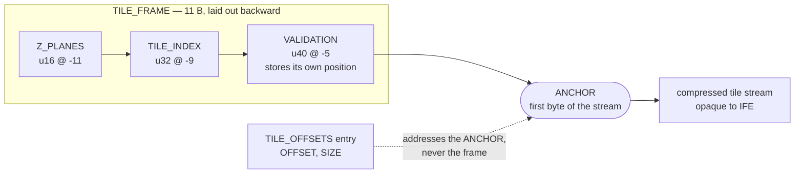

# Design notes

Things about this format that look like mistakes and are not. Read before
"fixing" one of them.

## TILE_PIXEL_DATA grows backwards, on purpose

Every other structure in the IFE is laid out forward from its own start: a
block begins at an offset and its fields follow at increasing displacements.
The tile frame is the one exception. Its displacements are **negative** —
`VALIDATION` at -5, `TILE_INDEX` at -9, `Z_PLANES` at -11 — measured back from
the first byte of the tile stream, which is the byte a `TILE_OFFSETS` entry
addresses.

This is deliberate, and it is what makes the header **optional**:

* **A tile offset always points straight at pixel data.** The entry addresses
  the stream itself, never a header in front of it, so a reader that wants
  bytes gets them with no indirection and no per-tile header to skip.
* **The frame is additive, not structural.** Because it grows backward from
  that anchor, a tile can carry one or not, and the offset that names the
  stream is identical either way. Adding a frame to an existing tile does not
  move the tile.
* **It supplies what the stream cannot.** `TILE_INDEX` is the thing no amount
  of reading a compressed stream can recover, since streams may be written in
  any order — which is what lets a recovery scan put a stream back in the
  right place.

**Consequences for anyone writing one:** `store()` takes the **anchor** — the
first byte of the stream — not the frame's own start, and the runtime builds
its handle the same way (`frame{__base, stream_at, ...}` in `IFE_Runtime.cpp`).
Passing the frame's start writes it five bytes early. That failure is quiet:
a `u40` storing its own position is self-consistent wherever it lands, so the
recovery scan accepts it and the frame appears "covered" while attached to no
stream at all. It was caught once (2026-08-18) only because the misplaced
write happened to land inside a `CIPHER` block and broke validation there.

The frame carries no recovery tag and is found by signature match, so it
appears in `recover_file_structure` and **never** in `generate_file_map` —
the offset graph has no edge that leads to it. Any coverage check that only
walks the graph will report a framed file as unframed.

**The contract, stated once:** the `u40` at `anchor - 5` holds `anchor - 5`,
where the anchor is the byte a `TILE_OFFSETS` entry names. Two ways to break
it, and they fail differently — both pinned in `ife_validation_tests.cpp`:

* Storing the offset the tile-offsets entry *carries* (the stream's address)
  instead of the field's own position. Every other block in the format stores
  its own start, so this is the mistake the layout invites — and `validate()`
  catches it, because the value and the position disagree.
* Storing a correct frame at the wrong place, which is what passing the frame's
  start rather than the anchor does. `validate()` **cannot** catch this: the
  frame is internally consistent. What catches it is validating at the offset
  the tile-offsets entry names, which is what a reader does anyway.

## Tile stream contents are not this library's business

Every corpus fixture fills its tile streams with `0xCD` and no test ever looks
at those bytes. That is not missing coverage — do not add an assertion over
them.

IFE defines the *byte structure*: where a tile stream starts, how long it is,
what the offsets and headers around it mean. It references streams in their
on-disk compressed form and never interprets one. Compression and
decompression belong to Iris-Codec, and the boundary is the whole reason the
two repositories are separate.

The line runs between the stream and everything describing it:

* **In scope** — `TILE_LENGTH`, `Z_PLANES`, `TILE_INDEX`, offsets, sizes,
  `NULL_TILE`, and every other structural field. These accessors are generated
  here, so a wrong derived offset is this repository's defect to catch, and
  `ife_v1_oracle_tests` asserts them by the hundred.
* **Out of scope** — what the compressed bytes decode to, whether a JPEG is
  valid, anything requiring a codec.

The same line explains the byte-array blocks: IFE checks that a run is sliced
where its sizes entry says, never what the slice means. `ICC_PROFILE` bytes are
compared for identity, not parsed as a colour profile.
