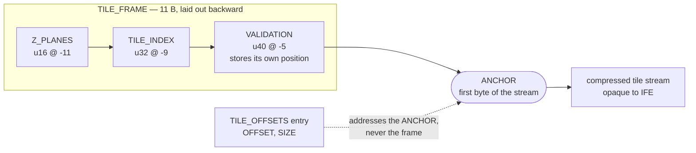
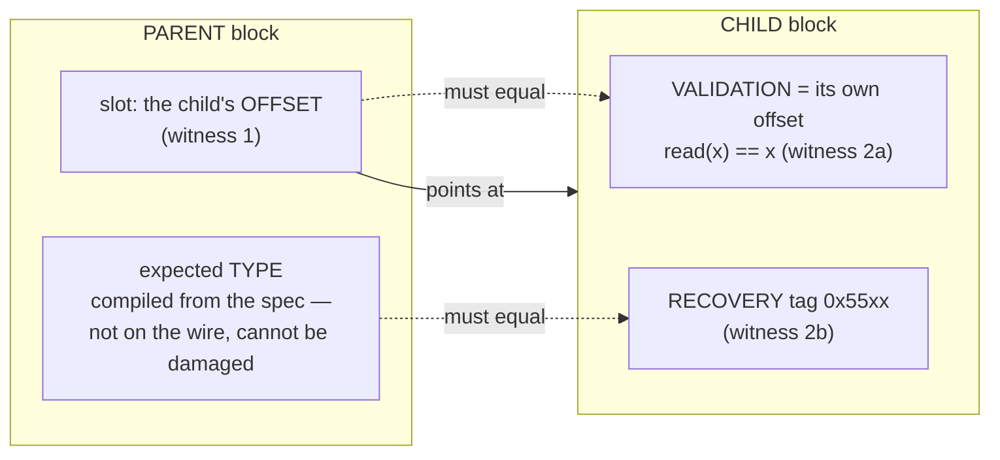

# Design notes

Things about this format that look like mistakes and are not. Read before
"fixing" one of them.

## TILE_PIXEL_DATA grows backwards, on purpose

Every other structure in the IFE is laid out forward from its own start: a
block begins at an offset and its fields follow at increasing displacements.
The tile frame is the one exception. Its displacements are **negative** —
`VALIDATION` at -5, `TILE_INDEX` at -9, `Z_PLANES` at -11 — measured back from
the first byte of the tile stream, which is the byte a `TILE_OFFSETS` entry
addresses.

```mermaid
flowchart LR
    subgraph FRAME["TILE_FRAME — 11 B, laid out backward"]
        direction LR
        Z["Z_PLANES<br/>u16 @ -11"]
        T["TILE_INDEX<br/>u32 @ -9"]
        V["VALIDATION<br/>u40 @ -5<br/>stores its own position"]
    end
    A(["ANCHOR<br/>first byte of the stream"])
    S["compressed tile stream<br/>opaque to IFE"]
    Z --> T --> V --> A --> S
    E["TILE_OFFSETS entry<br/>OFFSET, SIZE"] -. "addresses the ANCHOR,<br/>never the frame" .-> A
```

This is deliberate, and it is what makes the header **optional**:

* **A tile offset always points straight at pixel data.** The entry addresses
  the stream itself, never a header in front of it, so a reader that wants
  bytes gets them with no indirection and no per-tile header to skip.
* **The frame is additive, not structural.** Because it grows backward from
  that anchor, a tile can carry one or not, and the offset that names the
  stream is identical either way. Adding a frame to an existing tile does not
  move the tile.
* **It supplies what the stream cannot.** `TILE_INDEX` is the thing no amount
  of reading a compressed stream can recover, since streams may be written in
  any order — which is what lets a recovery scan put a stream back in the
  right place.

**Consequences for anyone writing one:** `store()` takes the **anchor** — the
first byte of the stream — not the frame's own start, and the runtime builds
its handle the same way (`frame{__base, stream_at, ...}` in `IFE_Runtime.cpp`).
Passing the frame's start writes it five bytes early. That failure is quiet:
a `u40` storing its own position is self-consistent wherever it lands, so the
recovery scan accepts it and the frame appears "covered" while attached to no
stream at all. It was caught once (2026-08-18) only because the misplaced
write happened to land inside a `CIPHER` block and broke validation there.

The frame carries no recovery tag and is found by signature match, so it
appears in `recover_file_structure` and **never** in `generate_file_map` —
the offset graph has no edge that leads to it. Any coverage check that only
walks the graph will report a framed file as unframed.

**The contract, stated once:** the `u40` at `anchor - 5` holds `anchor - 5`,
where the anchor is the byte a `TILE_OFFSETS` entry names. Two ways to break
it, and they fail differently — both pinned in `ife_validation_tests.cpp`:

* Storing the offset the tile-offsets entry *carries* (the stream's address)
  instead of the field's own position. Every other block in the format stores
  its own start, so this is the mistake the layout invites — and `validate()`
  catches it, because the value and the position disagree.
* Storing a correct frame at the wrong place, which is what passing the frame's
  start rather than the anchor does. `validate()` **cannot** catch this: the
  frame is internally consistent. What catches it is validating at the offset
  the tile-offsets entry names, which is what a reader does anyway.

## Tile stream contents are not this library's business

Every corpus fixture fills its tile streams with `0xCD` and no test ever looks
at those bytes. That is not missing coverage — do not add an assertion over
them.

IFE defines the *byte structure*: where a tile stream starts, how long it is,
what the offsets and headers around it mean. It references streams in their
on-disk compressed form and never interprets one. Compression and
decompression belong to Iris-Codec, and the boundary is the whole reason the
two repositories are separate.

The line runs between the stream and everything describing it:

* **In scope** — `TILE_LENGTH`, `Z_PLANES`, `TILE_INDEX`, offsets, sizes,
  `NULL_TILE`, and every other structural field. These accessors are generated
  here, so a wrong derived offset is this repository's defect to catch, and
  `ife_v1_oracle_tests` asserts them by the hundred.
* **Out of scope** — what the compressed bytes decode to, whether a JPEG is
  valid, anything requiring a codec.

The same line explains the byte-array blocks: IFE checks that a run is sliced
where its sizes entry says, never what the slice means. `ICC_PROFILE` bytes are
compared for identity, not parsed as a colour profile.

## Recovery: the two witnesses, and what they do not cover

Recovery exists because every parent→child reference is written **twice**. Get
this model right and the engine reads straightforwardly; get it wrong and every
change to `src/IFE_Recovery.cpp` is a guess.

```mermaid
flowchart LR
    subgraph P["PARENT block"]
        S["slot: the child's OFFSET<br/>(witness 1)"]
        E["expected TYPE<br/>compiled from the spec —<br/>not on the wire, cannot be damaged"]
    end
    subgraph C["CHILD block"]
        V["VALIDATION = its own offset<br/>read(x) == x (witness 2a)"]
        R["RECOVERY tag 0x55xx<br/>(witness 2b)"]
    end
    S -->|"points at"| C
    E -.->|"must equal"| R
    S -.->|"must equal"| V
```

`classify()` reads both and hams them:

* both agree → `Intact`.
* the child self-validates but the tag is wrong → the tag may be the damaged
  half (`TagRepaired`).
* the tag is right but `VALIDATION` is not → the position may be the damaged
  half (`PositionRepaired`).
* neither → the parent's offset is probably the damaged half: search for the
  child elsewhere (`Corroborated` from a surviving orphan, `HoleCorroborated`
  from a ranked hole position).

Those hypotheses compete **on one metric**, cheapest wins, equal costs are
`Ambiguous`, nothing within `IFE_RECOVERY_MAX_FLIPS` is `Unrecovered`. Deciding
by *shape* instead of by cost was the original defect: a flip that moves the
parent's offset onto an innocent valid block of another type looks exactly like
a flipped tag, and only the ranker separates them.

### Rules that were paid for

**Never hamming two damaged copies of one value.** When matching a broken
reference to a hole position, score the parent's damaged offset against the
candidate's **actual position** — the position is exact, it is where you are
standing. The candidate's own `VALIDATION` damage rides as a separate term.
Comparing the parent's damaged offset against the candidate's damaged stored
word compares two corrupted copies of the same number, and measured strictly
worse. `HoleCandidate::self_cost` is that separate term; there is deliberately
no field holding the stored word, because a field holding it is how someone
compares against it by mistake.

**The hole band is calibrated, not chosen.** A position enters the candidate
pool when `hamming(read(p), p) <= 2`. Real lost blocks spike at 1–2 bits; from
3 up is a flat coincidence floor, because an arena is full of offset words that
share high bits with their own position. Widening the band up front turned 11
clean verdicts `Ambiguous`. Widening **last**, against a pool earlier rounds
have emptied, is safe and is what the band loop does.

**Passes that reject may never promote.** Tag adjudication, the `TILE_INDEX`
filter and the exclusivity pass are all demote-only: they can turn a repair
into `Ambiguous`/`Unrecovered`, never the reverse. That is what makes them
unable to invent recovery — they only decline to guess.

**A missing reference that is reported is honest. A fabricated one is
believed.** Never trade the first for the second. This is the standing
constraint behind every verdict class.

**Two batch strengths, and using the wrong one silently disables the caller.**
`EveryChildCorroborates` is for when a block's TYPE is a hypothesis — a wrong
V-Table yields nonsense and the whole batch must go. `NoWildPointers` is for
following a repair, where the damaged child is *the thing being hunted*, so
demanding that every child corroborate discards exactly what the loop consumes
and stops the cascade at the first repair.

**Emitting references is not deriving an extent.** Bound an array's reference
emission by GEOMETRY (the stamped count when the arena has room, the largest
fitting extent when it does not). Bounding it by "walk until an entry fails to
validate" means an array whose first element is the broken one emits nothing,
so nothing goes looking for that element.

**`TILE_INDEX` is an identity witness, and it is matched EXACTLY.** A tile
stream is the format's one headerless child; its optional frame names which
tile it is. Adjacent tile indices differ by a single bit, so a hamming test
over an identity would re-admit precisely the neighbour confusion the field
exists to remove. Exact match or no opinion.

### What recovery does NOT cover — do not assert zero here

Damage to these is undetectable by construction. A test that asserts they are
recovered is asserting luck, and the first version of
`ife_recovery_bench_tests` did exactly that and failed correctly:

* **inline scalar values** (an attribute number, `microns_pixel`, a layer's
  `x_tiles`) — no second copy exists;
* **payload bytes** — `ICC_PROFILE`, `IMAGE_BYTES`, tile pixel data;
* **an UNFRAMED tile stream** — its entry is its own only witness, so a flipped
  offset that lands on a valid address cannot be contradicted;
* **an absent slot** — `NULL_OFFSET` is a value, so a flip in it turns absence
  into a pointer nothing disagrees with;
* **a block edge whose flipped offset lands on a valid block of the same type**
  — both witnesses at the new address are genuine, so `classify()` reports
  `Intact` and is right to. Measured: METADATA's `ATTRIBUTES` slot moving
  between three sibling `ATTRIBUTES` blocks.

The one thing that IS contracted: an edge whose child carries an identity
witness must never come back naming a different real block.
`ife_recovery_bench_tests` asserts that at every damage level and prints the
bits→percent curve beside it.

### Measuring recovery without fooling yourself

* **The clean baseline is the control.** A recovery change must leave an
  undamaged file bit-identical in its accounting. Any movement there is a
  defect until proven otherwise — a double-counting bug once read as a 34%
  improvement.
* **Both sides must count the same atom.** Baseline and recovered numbers come
  from one enumerator, never two that are supposed to agree. Two counters that
  drifted once reported 1091% recovery on an undamaged file.
* **A count cannot see misattachment.** Compare anchored units — keyed on the
  (parent, slot) holding the edge — or a child reattached to the wrong parent
  passes as recovered.
* **Rebuild before measuring.** A stale binary has reported both a false pass
  and a false 6-of-12 failure in this lineage.
* **Register every recovery test on BOTH build systems.** FastFHIR shipped a
  recovery engine Bazel was not compiling at all.

Handoff documents (`*handoff*.md`) are working notes and are **gitignored**.
What survives a handoff belongs in `MIGRATION.md`, here, or in a test.

## The Builder lays bytes down; it does not run the application

`Iris::File::Builder` claims space and writes every block; the application
that owns it (Iris-Codec's Encoder) does sources, codecs, threads, and file
names. Three things that look like missing features are that split:

* **The Builder does not choose or move files.** An encoder writes to the temp
  directory and moves the finished file into place; the Builder writes where it
  is told and leaves the file complete and closed at `finalize`. Do not add
  temp-file or publish logic to it.
* **The Builder never remaps.** Its arena is a large sparse reservation that
  never moves (lock-free claims depend on the base staying put); exhausting it
  throws. Do not add growth, expansion or a stop-the-world lock — reserve more.
* **The Builder does not start threads.** `append_tile` is safe from many
  threads, but which thread encodes which tile is the caller's decision.

IFE never depends on Iris-Codec; the codec depends on IFE. Namespaces show the
direction: `Iris::` is the core, `Iris::File::` is this repository.

## Warnings: `-Wswitch` only protects a switch with no `default:`

Both build systems compile first-party code with `-Wall -Wextra -Wswitch`
(`/W4` on MSVC) — `add_compile_options` in `CMakeLists.txt`, `_COPTS` in
`BUILD.bazel`. Neither uses `-Werror`.

`-Wswitch` is the reason the flags exist, and it is on by default in clang and
gcc; naming it is a guard against someone trimming `-Wall`, not new coverage.
What it actually buys is this: the `RepairClass` and `GapClass` tallies are
exhaustive `switch`es, so a new member of either enum fails to compile until
every tally handles it. Two ways to silently disarm that, both of which have
shipped in this lineage's sibling repository:

* **adding a `default:`** to one of those switches — the warning stops, and a
  new class lands in the default arm uncounted;
* **writing the tally as an `if`/`else if` chain**, which the compiler cannot
  check at all. The `GapClass` tally was one until RC-10.5.

Verify a warning flag by probe, never by reading the build file. Append a
throwaway enumerator, confirm the warning appears at every site that should
have caught it, then remove it. Appending it at the TOP of an enum whose first
member is `= 0` proves nothing: both share a value, so every value is still
covered and the switch stays exhaustive.

## The read path: a handle's bool is `validate()`

Since RC-10.1 a generated handle's `operator bool` means `validate()` passes —
both witnesses agree and every declared extent fits the file. It used to mean
only "the header is inside the file", and the read path navigated on it: one
flipped COUNT bit read a gigabyte past an 832-byte file while recovery
correctly reported nothing wrong.

* **Reading a file for its contents: test the bool.** A required slot is
  `if (!x) fail(x.validate())`; an optional one is `present(x)`, which reads
  NULL_OFFSET as absent and throws on anything else. Never let the bool alone
  decide an optional slot — a damaged block would read as absent, silently.
* **Reading a file you expect to be damaged: test `in_bounds()`.** Recovery,
  `generate_file_map` and `validate_deep`'s out-of-bounds check exist to see
  blocks that fail `validate()`; the bool there stops them at the first
  damaged block, silently. Every `in_bounds()` in `src/` is deliberate.
* **Walk a damaged array by geometry.** `ArrayHeader::readable()` — the whole
  entries that lie inside the file — never the stamped COUNT.
* **Never add to an offset to bound-check it.** `__offset + n <= size` wraps
  when a flipped NULL_OFFSET slot reads `0xFF..FE`. Write
  `__offset <= size && size - __offset >= n`.
* **A length on the wire is a claim.** COUNT, TITLE_SIZE, IMAGE_SIZE — anything
  used as a span must be bounded by `validate()` before one byte is copied.
  `IMAGE_BYTES` had no such bound, and `validate_file_structure()` passed a
  file that overran it.
* **`ORIENTATION` is read as raw bits.** Its accessor decodes the half to
  degrees, but `ImageOrientation`'s values ARE the half's bit patterns
  (`ORIENTATION_90` is `0x55A0`). The raw load in `IFE_Runtime.cpp` looks like
  it bypasses the accessor; that is the point.

`ife_damage_sweep_tests` runs every public read entry point over every
single-site damage. Run it under ASan+UBSan after any change here: the faults
it finds are invisible without the sanitizer.
