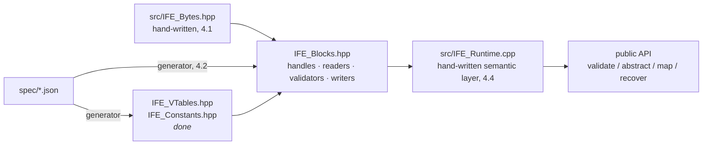

# IFE Migration — JSON-Specified Format, Generated Code & Documentation

> **Status (2026-08-07):** Phase 4 is under way. Tasks 4.0 (decisions A–H),
> 4.0-H, 4.1, 4.2a, 4.2b and 4.2c are **done**; 4.2d is next, then 4.3 and
> 4.4. The generated layer reads and validates; it does not yet write, and
> nothing outside the tests consumes it — `IrisFileExtensionLib` still
> compiles the hand-written `IrisCodecExtension.cpp`, and the cutover is
> Phase 6. One decision is open: **4.0-D** (visibility of generated symbols,
> reopened by the `.hpp`/`.cpp` split — a shared build exports zero
> `IFE::blocks` symbols). 4.0-E is fully closed: part 1 in the decision,
> parts 2–3 with 4.1 and the emitter. Gates in force: `--validate`, `--check`, the
> `static_assert` parity wall, and four test binaries under ASan+UBSan.
>
> **Broad plan below.** Each phase below gets a granular checklist
> (`plans/phase-N-*.md`) during a refinement pass **before** implementation
> begins. Implementation tasks are then executed by directed (flash-class)
> models working from those checklists; this document is the map, not the
> task list. **Exception: Phase 4's refinement pass is complete and lives
> inline** (see "Phase 4 implementation plan"), because it is the phase now
> in front of us — it is written to the flash-execution standard and is the
> task list for 4.x work.

## Objective

IFE is specified by a **JSON specification document** that is the single
source of truth for:

1. **The C++ serialization layer** — memory layouts, offsets, enumerations,
   validation and recovery tables are *generated*, never hand-written.
2. **The specification document** — a hand-authored *spec-basis* Markdown
   supplies the narrative (purpose, definitions, design rationale, prose about
   sentinels like `NULL_OFFSET`, figures); all layout tables, enumeration
   tables, and per-block sections are generated from the JSON and interleaved
   at build time — via AsciiDoc's native `include::`, the mechanism Khronos
   uses for the Vulkan specification — to produce PDF and HTML output.
3. **Language bindings** — Python and JavaScript/WASM surfaces are generated
   or generator-assisted, not hand-maintained.

## Guiding principles

* **Schema over hand-written.** The format is re-expressed as a schema
  informed by FastFHIR, eliminating the hand-written byte-offset vtables and
  enumeration tables. Where the refactoring surfaces a **documentation**
  defect (e.g. sentinel errata in the published tables, where the code was
  right), it is corrected deliberately with the rationale recorded. A
  *layout* defect cannot be corrected — the append-only invariant forbids
  moving a shipped field. It can only be deprecated and superseded by an
  appended field.
* **One source of truth.** After cutover there is no hand-written byte
  offset, enum value, or layout table anywhere — not in C++, not in the spec
  document, not in bindings.
* **Append-only is inviolable — this is the load-bearing invariant.** No
  version, major or minor, ever moves, resizes, retypes or removes an
  existing field. **We only add.** A field may be *deprecated* — readers
  ignore it, writers stop populating it — but **its slot stays, forever**.
  Everything else follows from this: the format is **bidirectionally
  compatible always**, not merely within a lineage; any reader can read any
  file to the extent of the fields it knows; and no version bump, of any
  kind, can ever require another migration like this one. Versioning is
  carried as schema machinery (per-field `since`, arrays storing their
  encoding-time stride) precisely so that adding is the only available
  move.
* **The schema is capped, permanently.** It describes what a byte **is**; it
  never describes what a program should **do**. This is a hard boundary, not
  a preference — the whole design depends on the description language staying
  weak. Rich specification languages are a well-documented dead end: ASN.1
  made every parser a security liability for decades on the strength of
  variable-length everything, optional fields, and multiple valid encodings
  of the same value. Pressure to add "just one feature" is the main long-term
  threat to this architecture, so the boundary is written down rather than
  remembered.

  **Permitted, and this is the whole list:** a field's name, its scalar type
  or enum reference, and the version group that introduced it; offset linkage
  (`points_to`, `nullable`); a constant a field always holds; the primitive a
  block derives from and its recovery tag; documentation (`description`,
  `errata`, `deprecated`); and validation predicates drawn from a **closed
  vocabulary** — range, enum membership, ordering, non-null — with no
  expression syntax.

  **Forbidden, permanently:** expressions or arithmetic of any kind;
  conditionals, so no field's presence, type or width may ever depend on
  another field's value; computed lengths — a length is a field, or it is
  `STRIDE`/`COUNT`, never a formula; literal offsets or sizes (the derivation
  rule); alignment or padding directives (packing is dense, everywhere);
  byte-order overrides (little endian, always); anything describing runtime
  behaviour — caching, threading, I/O, recovery policy; and any type whose
  width is not derivable from the schema alone, which is why there is no
  `string` type.

  **When a rule will not fit:** it stays in the specification prose and is
  hand-written into the validation layer. That is the designed escape valve
  and using it is not a failure. The moment a proposal needs `if`, the answer
  is no.

* **Modularity is preserved.** This repository defines structure and
  validation; Iris-Codec implements compression and the user-facing API.
  The cutover is coordinated with Iris-Codec, but the boundary does not
  move. Generated artifacts are never committed: they are regenerated into
  `generated_source/` (gitignored) by the stdlib-only
  `generator/` at configure time whenever absent. Downstream consumers need
  Python 3 (stdlib only) at configure time and nothing more.
* **Recoverability is a feature.** v1's self-validating blocks (offset
  validation + recovery tags) made deep validation and corruption recovery
  trivial. The schema keeps and strengthens this (universal block header,
  unique recovery tags sharing the high-entropy `0x55` prefix that makes a
  recovery scan's false-positive rate negligible).

## Phase overview

| Phase | Deliverable | Depends on |
|------:|-------------|-----------|
| 1 | Schema design decisions (`spec/DESIGN.md`) | — |
| 2 | `spec/ife_fields.json` + `spec/ife_constants.json` + stdlib spec validator | 1 |
| 3 | Generator `generator/` (`python -m generator`) → `generated_source/` (gitignored, regenerated at configure) | 2 |
| 4 | Generated runtime: serialization, deserialization, validation, recovery | 3 |
| 5 | Spec document pipeline: AsciiDoc narrative + generated `include::` files → PDF/HTML | 2 (parallel with 3–4) |
| 6 | Bindings, tooling, corpus, downstream (Iris-Codec) cutover, release | 4, 5 |

---

## Phase 1 — Schema design

Decide, and record with rationale in `spec/DESIGN.md`, everything the JSON
spec will encode. Broad checklist:

- [x] **Universal block header — settled (4.0-G/H).** 10 B
      (`VALIDATION` u64 + `RECOVERY` u16) on every data-block, and **the file
      header remains the special case** exactly as shipped: it opens with
      `MAGIC` + `RECOVERY` and carries no `VALIDATION`. Byte-blob arrays add
      only `COUNT`; typed-entry arrays add `STRIDE` + `COUNT`. The format is
      frozen at shipped 1.0.
- [x] **File identification — settled (4.0-G).** As shipped: `MAGIC`
      (`0x49726973`) at byte 0, `RECOVERY` (`RECOVER_FILE_HEADER`) at byte 4 —
      the two checks `src/IrisCodecExtension.cpp:275-282` already performs.
      No older-file class exists to distinguish.
- [x] **Version encoding — settled (4.0-G/H).** As shipped: `EXTENSION_MAJOR`
      @14 and `EXTENSION_MINOR` @16 **inside `FILE_HEADER`**, composed as
      `major<<16 | minor`. Because append-only is never broken, **any** newer
      file — minor or major — stays structurally readable to the extent of the
      fields the reader knows: read the known prefix and **warn**
      (`src/IrisCodecExtension.cpp:853-865`). Structural rejection is never
      necessary and must not be added. A major bump may still signal
      *semantic* incompatibility (a newly required block an old reader cannot
      act on) — a policy judgement for the consuming application, not a
      parsing failure. See "Version gating — the v1 mechanism,
      reverse-engineered".
- [x] **Recovery-tag space — settled (4.0-A).** v1's `0x55xx` high-entropy
      convention carries forward unchanged; the tag list stays flat. No
      partitioned ranges and no array bit — see 4.0-A for the four reasons.
- [x] **Array subsystem — settled (primitives + 4.0-H).** Two array
      primitives, not one: `array` (`STRIDE` + `COUNT`, stride stored because
      it can vary) and `byte_array` (`COUNT` only, stride intrinsically 1).
      v1's externally-sliced byte arrays are **kept** as shipped — the
      format is frozen at 1.0. See "Primitive block types".
- [x] **Field type system — settled.** Vocabulary as shipped: `u8`–`u64`
      including the packed widths `u24` and `u40`, plus `f32`/`f64`; `f16` is
      declared but unused and must raise `SpecError` if ever referenced
      (4.0-E). **Dense packing — no alignment padding anywhere**: a field
      begins at the cumulative width of its predecessors, which is why
      `FILE_SIZE` sits at an unaligned offset in the shipped root and why
      4.1's primitives are `memcpy`-only (an aligned-load implementation
      would be undefined behaviour here). **Always little endian on disk**,
      at every version: a big-endian host byte-swaps on load and store, which
      is what the `__BE_*` half of `src/IrisCodecExtension.cpp:125-177`
      exists for. Both statements are normative and belong in the spec
      document.
- [x] **Block inventory — settled (4.0-G/H).** All 16 blocks carry into the
      schema exactly as shipped; none changes shape. `CIPHER` **stays**,
      reserved. Room for FastFHIR-style extension routing is provided by the
      `primitives` mechanism — a future primitive is declared and inherited
      rather than bolted onto each block.
- [x] **Concurrency & write model — settled (4.0-F): out of scope for this
      repository.** Concurrent encoding is the Iris Codec's concern; the spec
      says nothing about it and it implies nothing on disk. The `IFE_Memory`
      VMA substrate was deleted — encoding is the Iris Codec's concern (4.0-F).
- [x] **Coexistence policy — settled (4.0-G): none required.** The format
      does not change, so there is no transition. Existing files remain
      readable by definition; parity is enforced by the `static_assert` wall
      in 4.0-H.

**Exit:** every decision above logged with a short rationale; no open
"TBD" affecting Phase 2.

## Phase 2 — JSON specification

**Status (2026-08-07): delivered except two items, both named below.** The
documents are authored and the validator runs before every generation. What is
*not* built: **the append-only diff check** (validator item 1 — the invariant
every compatibility guarantee in this document rests on is still unenforced),
and the **normative shall/should/may clauses** in the JSON, which 4.6 needs and
which no field currently carries. Neither blocks Phase 4; the first blocks
Phase 6.

- [ ] **Spec validator** — `python -m generator --validate`, stdlib-only,
      run in CI beside `--check`. **Built, minus item 1** —
      `generator/validate.py` implements 2–5, and `.github/workflows/ci.yml`
      runs it. Checks, in rough order of importance:
      1. **The append-only invariant**: no field removed, retyped, resized or
         reordered against the previous committed spec; retirement only via
         `deprecated`. Without this the invariant is a convention that one
         careless edit silently breaks, and every compatibility guarantee in
         this document rests on it.
      2. Unique recovery tags; unique enum values within a group; unique
         field names within a block.
      3. `points_to` targets name existing blocks; `enum` references name
         existing groups; every block's `recovery_tag` exists.
      4. Version monotonicity (`since` ≤ the document version), and identical
         `spec` identity blocks across the two documents.
      5. Structural well-formedness — required keys, name patterns, value
         forms.
      **Not a JSON Schema, deliberately.** `spec/ife.meta.schema.json` was
      written and deleted: checks 1–4 are inexpressible in JSON Schema (1 is
      a property of the *diff* between revisions, 2 is uniqueness over object
      values, 3 is cross-document), it would need `jsonschema` in a
      deliberately stdlib-only toolchain, and check 5 duplicates the
      `SpecError` paths `generator/model/layout.py` already raises — a second
      source of truth for the same question. Do not re-propose it. The
      `$schema` keys that referenced it have been removed from both instance
      documents.
- [x] **`spec/ife_fields.json` + `spec/ife_constants.json`** authored per Phase 1 decisions, covering:
      constants/sentinels, enumerations, header blocks, array blocks and
      entry layouts, versioning semantics, validation rules. Plus
      `ife_header.json`, which Phase 1 did not anticipate: specification
      identity stated once so two documents cannot disagree about it.
- [ ] **Doc-generation fields baked in from the start:** per-item `description`,
      normative clauses tagged shall/should/may, section anchors, cross
      references, units/ranges, equation hooks — everything Phase 5 needs so
      the schema never needs a redesign for documentation. **Partial:**
      `description`, `errata` and `unspecified` are carried; **no normative
      clause tagging exists yet** — 4.6 step 2 is where it lands, and it must
      stay inside the capped predicate vocabulary.
- [x] **Derivation rule:** byte offsets and block sizes are *never* stated in
      the JSON; they are derived from field order and type by consumers
      (generator and doc pipeline), eliminating transcription drift.

**Exit:** schema validates; a design review reads the JSON side-by-side with
`DESIGN.md` and finds no divergence.

## Phase 3 — Code generator

**Status (2026-08-07): the generator is built and feeding Phase 4.** Five
artifacts emit from `spec/` alone and regeneration is byte-stable. Outstanding:
**binding surfaces** (nothing emitted for Python or WASM) and the `--check`
parity redesign, which was always future work.

- [x] **`generator/`** — Python stdlib-only package run as `python -m generator`, deterministic output (stable
      ordering, no timestamps). Gated by `--validate` and `--check` rather than
      by unit tests of its own; the C++ test binaries are what execute its output.
- [x] **Emitted C++** (regenerable, gitignored under `generated_source/`): enumerations;
      layout/vtable constants; POD data types; field keys; validation and
      recovery tables; version-aware block sizes (per-`since` gating data so
      runtime version checks are table-driven, not hand-threaded).
      `IFE_Constants.hpp`, `IFE_VTables.hpp`, `IFE_Blocks.hpp` + `.cpp`.
- [ ] **Emitted binding surfaces** (stubs acceptable initially): field-key
      tables for Python and WASM/Emscripten. **Not started** — Phase 6.
- [x] **Build integration:** configure-time generation when `generated_source/`
      is absent or `-DIFE_RUN_GENERATOR=ON`; CI check that
      regeneration is diff-clean; generator is stdlib-only Python.
      `CMakeLists.txt:110-137` and `.github/workflows/ci.yml`.
- [ ] **`--check` parity, not byte-equality (future).** The current
      `--check` is exact character equivalence: regenerate in memory, diff
      against the on-disk files byte-for-byte. That gate is brittle — it
      flags every *legitimate* change (a spec version bump, the banner's
      copyright year rolling over at New Year) as drift until regeneration,
      and byte-equality cannot answer "was this produced from the current
      spec?" Replace it with a generated-parity check: embed the schema
      version (and a hash of the input JSON) in each output's banner, and
      have `--check` verify the on-disk files carry the current version.
      The gate then asks "is `generated_source/` in parity with `spec/`?"
      instead of "is the diff empty?".

**Exit:** regeneration byte-stable; generated headers compile standalone;
CI drift gate green.

## Phase 4 — Generated runtime

- [ ] **Serialization/deserialization core** built on the generated layer:
      block writers/readers, offset-chain traversal, version-gated reads
      driven by generated tables (no hand-written `// VERSION CONTROL`
      sentinels anywhere).
- [ ] **Validation:** offset validation, recovery-tag checks, deep
      `validate_file_structure` equivalent, with error messages sourced from
      the JSON's normative clauses.
- [ ] **Recovery:** file-map generation and corruption-recovery scan
      matching against the generated recovery-tag value set.
- [x] **Memory substrate decision — executed: delete (4.0-F).**
      `IFE_Memory.hpp/.cpp`, `tests/ife_memory_tests.cpp`, and the
      `IFE_USE_FASTFHIR_SUBSTRATE` option are removed; the substrate belongs
      to Iris-Codec ('how'), not the spec ('what'). No dormant half-features
      remain.
- [ ] **Public API:** define the generated surface (successor to
      `validate_file_structure` / `abstract_file_structure` /
      `Serialization::` / `Abstraction::`), designed with Iris-Codec's
      consumption in mind; legacy v1 API retired on a coordinated schedule
      (Phase 6).
- [ ] **Tests:** unit tests per block; multi-threaded write stress (TSan);
      corrupted-input fuzzing of the validators; round-trip
      encode→validate→decode property tests.

**Exit:** a file can be encoded, validated, mapped, recovered, and decoded
entirely through generated-layer code; test suite green including TSan.

### Phase 4 implementation plan (refined from the `IrisCodecExtension.hpp`/`.cpp` review)

The hand-written v1 surface (`src/IrisCodecExtension.hpp`, 1294 lines;
`.cpp`, 3392 lines) decomposes into three strata. The plan generates what is
mechanical and hand-writes — once — what is semantic:

| Stratum | v1 form | Fate |
|---------|---------|------|
| **A — Layout constants** | `vtable_sizes` / `vtable_offsets` enums inside every `Serialization::` struct | **Done.** Generated as `IFE_VTables.hpp` + `IFE_Constants.hpp`. |
| **B — Mechanical block I/O** | Per block: `size()`, `validate_offset()`, `validate_full()`, typed field reads; 9 `SIZE_*` / 13 `STORE_*` free functions driven by hand-written `*CreateInfo` structs; the `DATA_BLOCK` base | **Generate.** Every element is derivable from `ife_fields.json` (`type`, `enum`, `constant`, `points_to`, `nullable`, version groups). |
| **C — Semantic runtime** | `abstract_file_structure`, `generate_file_map`, recovery scan, the `Abstraction::` structs, entry points, Emscripten remote fetch | **Hand-write once** against stratum B. Not generatable: it encodes intent (what to lift into RAM, map ordering, recovery policy), not layout. |



#### Execution protocol — binding for every 4.x task

The tasks below are written to be executed by directed (flash-class) models.
Follow every rule; where a rule and a task conflict, the rule wins.

1. **One task per session, and every session starts cold.** Execute exactly
   one numbered task (e.g. `4.2b`). Assume no memory of any earlier task —
   nothing carries over but what is on disk. Before touching anything, read,
   in this order: (a) "Ground truth", (b) "Version gating — the v1 mechanism,
   reverse-engineered", (c) the task itself, (d) everything in the task's
   *Read first* and *v1 precedent* lists. Do not batch, do not "also fix"
   something noticed in passing — note it in one line at the end and stop.
2. **Never invent an identifier.** Every symbol written must either appear
   verbatim in the task, or be copied from a file the task's *Read first*
   list names. To enumerate a C++ file's real symbols:
   `grep -n "^struct\|^class\|^namespace\|^inline\|^Result\|^void\|^Size" <file>`.
   For Python: `grep -n "^def \|^class " <file>`. If a needed name cannot be
   found, **STOP** and report what was searched.
3. **Never hand-edit `generated_source/` or `generated_docs/`.** Those files
   carry a DO-NOT-EDIT banner and are overwritten. Change the emitter in
   `generator/emit/cpp.py` and regenerate.
4. **Verify with the exact commands in *Done when*, and paste their output.**
   Baseline commands, from the repo root:
   `python3 -m generator` then `python3 -m generator --check` (must print
   `generator: outputs are current (no drift)` and exit 0).
5. **Minimal diffs.** Change only what the task names. No reformatting, no
   import re-sorting, no tidying of adjacent code.
6. **Do not touch the v1 files** (`src/IrisCodecExtension.hpp/.cpp`) in any
   4.x task. v1 stays compiling and shipping until Phase 6 retires it; the
   new layer is built alongside it.
7. **⚠ tasks stop for a human.** A task marked ⚠ contains a decision a flash
   model must not make. Produce the analysis it asks for and STOP.

#### Ground truth (verified against the tree, 2026-08-06)

Do not re-derive these; do not contradict them without re-verifying.

| Fact | Value |
|---|---|
| Blocks in `ife_fields.json` | **16** — 5 `kind: header` (`FILE_HEADER`, `TILE_TABLE`, `CIPHER`, `METADATA`, `ATTRIBUTES`), 11 `kind: array` |
| Array blocks | 6 with typed entries (`LAYER_EXTENTS`, `TILE_OFFSETS`, `ATTRIBUTE_SIZES`, `IMAGES`, `ANNOTATIONS`, `ANNOTATION_GROUP_SIZES`); 5 blobs (`ATTRIBUTE_BYTES`, `IMAGE_BYTES`, `ICC_PROFILE`, `ANNOTATION_BYTES`, `ANNOTATION_GROUP_BYTES`) |
| Arrays carrying block-specific header fields | 2 — `IMAGE_BYTES` (`TITLE_SIZE`, `IMAGE_SIZE`), `ANNOTATIONS` (`GROUP_SIZES_OFFSET`, `GROUP_BYTES_OFFSET`) |
| Fixed sizes *(as currently generated — 4 of these are wrong, see the parity audit)* | preamble **8 B** (to be deleted); universal block header **10 B** (`VALIDATION` u64 @0, `RECOVERY` u16 @8) — correct; typed-array header **16 B** (`STRIDE` u16 @10, `COUNT` u32 @12) — correct; blob-array header must be **14 B** (`COUNT` @10, no `STRIDE`) |
| `FILE_HEADER` | shipped: **38 B at byte 0**, opening with `MAGIC`, no `VALIDATION`, version fields inside. Currently generated as 38 B at byte 46 — wrong; fixed by 4.0-H |
| `CIPHER` | zero block-specific fields ⇒ `header_size` 10 (universal header only) |
| Entries always begin at | `block_offset + <block>::header_size` — **not** `array_header::total_size` |
| `points_to` also appears on **entry** fields | `IMAGES.IMAGE_ENTRY.BYTES_OFFSET` → `IMAGE_BYTES`; `ANNOTATIONS.ANNOTATION_ENTRY.BYTES_OFFSET` → `ANNOTATION_BYTES` |
| Packed widths in use | `u24` (`ANNOTATION_ENTRY.IDENTIFIER`, `.PARENT_ID`, `TILE_OFFSET.SIZE`), `u40` (`TILE_OFFSET.OFFSET`) |
| Sentinels (`IFE_Constants.hpp`) | `MAGIC_BYTES` 0x49726973, `NULL_OFFSET` 0xFFFFFFFFFFFFFFFF, `NULL_TILE` 0xFFFFFFFFFF, `NULL_ID` 0xFFFFFF |
| Recovery tags | flat `0x5500`–`0x5510`, carried over from v1; unique, sharing the `0x55` high byte. Deliberately **not** partitioned and **no** array bit — settled in 4.0-A |
| CMake already compiles generated code | `CMakeLists.txt:128-137` GLOBs `generated_source/*.cpp` and `*.hpp` with `CONFIGURE_DEPENDS` and appends them to the library — **adding a generated file needs no CMake edit** |
| Generator regen trigger | `IFE_RUN_GENERATOR=ON`, or `generated_source/IFE_VTables.hpp` missing (`CMakeLists.txt:110-124`) |
| Tests today | `tests/ife_bytes_tests.cpp` + `tests/ife_wire_parity_tests.cpp`; framework-free `IFE_CHECK` macro + `g_failures` + non-zero exit; gated by `IFE_BUILD_TESTS` alone (no substrate requirement) |

#### Version gating — the v1 mechanism, reverse-engineered

**Version gating is a core feature of the format, not an implementation
detail.** v1 already implements it correctly and completely by hand; Phase 4
does not redesign it, it *generates* it. Read this section before 4.2a, 4.2b
or 4.4 — it is the contract being reproduced.

The eight moving parts, each verified in the v1 source:

| # | Mechanism | v1 implementation | Fate in Phase 4 |
|---|---|---|---|
| 1 | **Version is one packed `uint32_t`** | `major << 16 \| minor`; `IRIS_EXTENSION_1_0 = 0x00010000` (`.cpp:107`), current build is `IFE_VERSION = IRIS_EXTENSION_MAJOR<<16\|IRIS_EXTENSION_MINOR` (`.cpp:272`) | **Keep verbatim.** One integer compare per gate. |
| 2 | **Read once, at the root** | `read_header` composes `header.extVersion` from the `EXTENSION_MAJOR`/`EXTENSION_MINOR` u16 fields of `FILE_HEADER` (`.cpp:912-913`) | **Keep, new source.** The v2 schema moved the version out of `FILE_HEADER` into the **preamble** (`SPEC_MAJOR` @4, `SPEC_MINOR` @6). Same composition, different two bytes. |
| 3 | **Propagated by construction, never re-read** | every `DATA_BLOCK` carries `uint32_t __version` (`.hpp:401`); children are built with the parent's value — `TILE_TABLE(offset, __size, header.extVersion)` (`.cpp:929-930`) | **Keep verbatim.** Generated handles carry `__version` and pass it to every `points_to` target. |
| 4 | **Root bootstrap** | `FILE_HEADER` is constructed with `UINT32_MAX` (`.cpp:806`) — its own version is unknowable until it is read, so the max value opens every gate for exactly one block | **Keep.** The preamble read (mechanism 2) is the only thing done before a real version exists. |
| 5 | **The gate itself** | `if (__version > IRIS_EXTENSION_1_0); else <early-exit>;` — empty then-branch, **58 sites** in the `.cpp`. Early exit is `return <value>` in scalar readers, `goto <LABEL>` in array functions (jumping past the version-N region into the shared loop), `continue` inside per-entry loops | **Replaced.** Hand-threaded control flow is what generation exists to remove: a gated accessor returns `std::optional<T>`, empty when `__version` is below the field's `since`. Same semantics, no `goto`, no empty `if`. |
| 6 | **Cumulative size constants** | each `vtable_offsets` enum ends `HEADER_V1_0_SIZE = <last field> + <its size>`, then `HEADER_SIZE = HEADER_V1_0_SIZE` — **30** such constants. `HEADER_V1_0_SIZE` is what a reader uses as the entries-start offset (`start = __offset + HEADER_V1_0_SIZE`, `.cpp:1653`); `HEADER_SIZE` means "size at the newest version this build knows" | **Generate.** `header_size_v1_0` per version group + `header_size` = newest. Derived from field order, never hand-maintained. |
| 7 | **Arrays gate twice** | the block-level version gate, **plus** the stored `ENTRY_SIZE` — loops step by the file's stride (`__array += STEP`, `.cpp:1670`), so a v2 entry with extra trailing fields is stepped over correctly by a v1 reader | **Keep, generate.** Data-driven, not code-driven; the emitter must iterate by `stride()`, never by the generated `entry_size`. |
| 8 | **Newer file ⇒ warn, do not reject** | `validate_header` flags `IRIS_WARNING_VALIDATION` and tells the user to upgrade (`.cpp:853-865`); it returns `IRIS_SUCCESS` | **Keep verbatim, and never harden it.** Append-only guarantees a newer file is always readable to the known prefix — major included. Rejection is never structurally justified; do not add a reject path. |

**The marker convention is part of the contract.** v1 terminates every
append-only ordered list in the header with a cumulative size constant, the
`// Version N.M ends here.` line, a dashed rule, a blank line, then the
newest-version alias. **The canonical form is
`src/IrisCodecExtension.hpp:445-449`** — go read those five lines; do not
work from a paraphrase. There are **23** occurrences, and not only in field
enums: the `Serialization::`
forward-declaration lists carry it too (`.hpp:96`, `.hpp:110`), because those
lists are append-only as well. The matching executable region in the `.cpp`
carries the banner `// VERSION CONTROL: VERSION 2 PARAMETERS ARE ADDED HERE`
— **57** occurrences. Together they answer, at a glance and at every single
site, "where does this version end and where does the next one get appended."

**The generator must emit both.** Losing them would make generated code less
readable than the hand-written code it replaces — the wrong direction. See
4.2b rule 7 for the exact emission.

#### 4.0 — ⚠ Decisions to close before any code below

Each is a one-paragraph entry in `spec/DESIGN.md` with its rationale. A
**default** is given so 4.1+ is never blocked; the default ships if no other
decision is recorded.

**v1 precedent — visit before deciding:** `src/IrisCodecExtension.hpp:39`
(the `IrisCodecExtensionValidateEncoding` macro, decision B); `:55-71` (the
`IFE_EXPORT_API` / `IFE_EXPORT` visibility scheme, decision D); `:85`
(`MAGIC_BYTES`) with `src/IrisCodecExtension.cpp:275-282`
(`is_Iris_Codec_file` — how v1 recognizes its own files, decision G);
`src/IrisCodecExtension.hpp:326-337` (`Serialization::Offsets` — the v1
sentinel set, decision A).

- [x] **A. Recovery-tag space — DECIDED: keep the flat list; the promise of a
      partitioned space and an array bit is struck.** `ife_constants.json`
      keeps v1's `0x5500`–`0x5510` unchanged. Rationale: (1) the shared
      `0x55` high byte *is* the partition that earns its keep — it is what
      makes a coincidental `u16` unlikely to be mistaken for a tag during a
      recovery scan, and it already exists; (2) with 16 blocks, classifying a
      tag as header-vs-array is a generated lookup, so a reserved bit buys a
      bit-test over a switch and nothing else; (3) FastFHIR's `0x8000` array
      bit exists because its tag space is open-ended and third-party
      extensible — IFE has one specifying authority and a closed block list;
      (4) changing tag values would invalidate the published spec tables for
      no functional gain. The recovery scan (4.4) matches against the
      generated value set.
- [x] **B. Encode-time validation — DECIDED: a Vulkan-style validation
      layer, not a compile-time macro.** `IrisCodecExtensionValidateEncoding`
      (`src/IrisCodecExtension.hpp:39`) is retired: it is `#define ... 1`
      unconditionally, so the knob it advertises does not exist. It is
      replaced by an optional layer, attachable at runtime, that costs a null
      check when absent. Two tiers, and the split matters:
      - **Structural validation stays inline and mandatory** — `VALIDATION`
        equals the block's own offset, `RECOVERY` equals the tag, bounds fit
        the file. This is 4.2c's generated `validate()`: a few integer
        compares, no allocation. v1 already states the principle at
        `src/IrisCodecExtension.hpp:41` — *"Decoding extension validation
        cannot be disabled"* — and that stays true.
      - **The layer is a development tool, not a production dependency.**
        Exactly as with Vulkan: developers attach it to prove an encoder
        emits conformant files, and ship production binaries without it. It
        is therefore free to be verbose, thorough and slow — it never runs in
        the hot path of a shipped product, so no check needs to justify
        itself on cost. It is built as its own dynamically-linked target and
        is never a link-time dependency of the library.
      - **Spec-conformance validation moves into the layer** — the "shall"
        clauses: `X_TILES`/`Y_TILES` ≥ 1, layer scale strictly increasing,
        enum values within the permitted set. v1 implements these inline at
        `src/IrisCodecExtension.cpp:1671-1677` and in
        `VALIDATE_ENCODING_TYPE` / `VALIDATE_PIXEL_FORMAT` (`:670-700`),
        building `std::string` diagnostics that cite the spec section.
        That is layer work, not hot-path work.
      - **Mechanism — what we take from Vulkan and what we deliberately
        don't.** In Vulkan, layers are separate shared libraries discovered
        through JSON manifests, enabled *at `vkCreateInstance`* (or by env
        var / config file), and spliced into a **dispatch chain built once at
        creation time**: app → loader trampoline → layer₁ → … → loader
        terminator → driver. Nothing is tested per call; the dispatch table
        entry simply points at the driver when no layer is present. Layers
        report through a registered debug-messenger callback, not by
        printing. Modern validation is one consolidated layer
        (`VK_LAYER_KHRONOS_validation`), not many.
        **Take:** (1) the validating code lives in a **separate library**
        that need not be linked at all; (2) attachment is decided **once, at
        writer/encoder creation** — never per call, never per block;
        (3) diagnostics go to a **caller-registered callback** so the layer
        never owns I/O policy; (4) hooks are **chainable** (a `next` pointer)
        so a future tracing or capture layer composes rather than competes;
        (5) one consolidated layer.
        **Don't take:** the loader, trampolines, terminators and manifest
        discovery. That machinery exists because Vulkan must multiplex many
        independent third-party drivers behind a stable C ABI with
        system-wide layer discovery. IFE has one implementation and one
        primary consumer; a manifest loader here would be cargo cult.
        **Concretely:** the writer context carries a `const ValidationHooks*`,
        resolved once at creation and null when no layer is attached — not a
        mutable global, which would be neither thread-safe nor consistent
        with the state-minimization rule. The *call site must be emitted from
        day one*: adding a dispatch point later is a breaking change, which is
        why 4.2d emits it even though 4.6 implements the layer.
      - **The layer is generated too.** Its checks come from the JSON's
        normative clauses, so the diagnostics and the spec document (Phase 5)
        cite the same source. This makes Phase 2's "normative clauses tagged
        shall/should/may" load-bearing rather than documentation-only.
- [x] **C. Type dependency — DECIDED: Iris-Headers throughout.** Generated
      code uses `Iris::Offset`, `Size`, `BYTE` and `Result` directly, as the
      hand-written layer does. No IFE-local alias set, and no conversion layer
      at the runtime boundary. Consequences the 4.x tasks must honour:
      - `IFE_Blocks.hpp` **`#include`s the Iris headers itself** rather than
        relying on include order. Note the hand-written header does *not* —
        `src/IrisCodecExtension.hpp:77` says `using namespace Iris;` but the
        `.cpp` is what includes `IrisTypes.hpp` first (`:42-45`). Generated
        headers must be self-contained; do not reproduce that fragility.
      - `IFE_Constants.hpp` and `IFE_VTables.hpp` stay dependency-free (they
        are pure integers); **only `IFE_Blocks.hpp` gains the dependency.**
        The "generated headers compile standalone" property therefore holds
        for two of the three — adjust the 4.2b compile check accordingly.
      - `4.1`'s `IFE_Bytes.hpp` uses the Iris scalar types too; it does not
        declare its own `Byte`/`Offset`/`Size`.
- [ ] **D. `IFE_EXPORT` — ⚠ REOPENED. The premise no longer holds.** The
      original decision was that generated block code is header-only
      `inline`/`constexpr`, so there is no symbol to export. Since 4.2b's
      `.hpp`/`.cpp` split (see "Generated code ships as a header and a source")
      the definitions are compiled into the library, and the library is built
      with `CXX_VISIBILITY_PRESET hidden`.
      **Measured:** a shared build exports **zero** `IFE::blocks` symbols
      (`nm -gU libIrisFileExtension.dylib | grep IFE6blocks` → 0). A consumer
      linking the shared library today cannot call a generated accessor.
      Nothing consumes the generated layer yet, so this is latent rather than
      broken — but it must be settled before the Phase 6 cutover. Three ways:
      1. **Emit `IFE_EXPORT` on generated definitions**, reusing the scheme at
         `src/IrisCodecExtension.hpp:55-74`. Matches how v1's
         `Serialization::` structs are consumed today; a consumer links and
         calls, exactly as now.
      2. **Consumers use `IFE_HEADER_ONLY`** (or compile
         `generated_source/IFE_Blocks.cpp` into their own target). No exported
         ABI at all, and each consumer inlines everything — arguably the right
         answer for a layer that is pure field arithmetic.
      3. Both: export by default, header-only available.
      *Recommendation:* (1), because it keeps the Iris-Codec cutover a
      re-point rather than a build-system change — but it is a distribution
      decision, not a code one.

- [x] **E. `f16` — DECIDED, and half-applied.** The earlier "fail loudly"
      decision was made on a false premise: `image_orientations` declared
      `"underlying_type": "f16"` and `IMAGES.IMAGE_ENTRY.ORIENTATION`
      resolved through it, so raising `SpecError` on `f16` would have failed
      on the current spec. `f16` is genuinely part of IFE 1.0.
      1. **`image_orientations` is no longer an enumeration — DONE.** Its own
         description said *"Any degree value is legal; these constants are
         provided for convenience"*, which describes named constants over a
         continuous scalar, not an enumeration — and C++ has no
         `enum class : float` to emit it as. Applied: the seven orientations
         moved into `statically_defined_values` as `f16` constants;
         `ORIENTATION` retyped from `enum` to `"type": "f16"`. **The wire is
         unchanged** — verified by regenerating and diffing `IFE_VTables.hpp`
         with comments stripped: every offset and size identical,
         `ORIENTATION` still 2 B at entry offset 18, `IMAGE_ENTRY` still
         20 B. The dangling `{{constants:image_orientations}}` anchor in
         `spec/ife_spec.md` was repointed at section 2.2.
      2. **`f16` accessors — DONE, landed with 4.1.** `load_f16`/`store_f16`
         in `IFE_Bytes.hpp` return `float`, converting from the wire's
         binary16 bit pattern. Width is 2 B either way — an accessor-typing
         fix, not a format change.
      3. **Consequence — DONE (landed with the emitter):** the seven
         constants now emit as `inline constexpr std::uint16_t
         ORIENTATION_90 = 0x55A0;` — bit patterns. Once the accessor returns
         `float`, comparing it against a `uint16_t` bit pattern silently
         never matches. When `f16` support lands, `emit_constants_header`
         must **decode `f16` sentinels at generation time** and emit
         `inline constexpr float ORIENTATION_90 = 90.0f;`. The JSON keeps
         the authored hex — it is the on-wire value, consistent with every
         other sentinel — and the generator does the conversion.
      *Still true from the original decision:* a type the generator genuinely
      cannot emit must raise `SpecError` naming the offending field, never a
      silently-wrong accessor.
- [x] **F. `IFE_Memory` — DECIDED: delete, deferred to Phase 4 exit.** Not
      adopted. **Rationale (this is the load-bearing part — record it in
      `DESIGN.md`):** the substrate is a fine piece of FastFHIR-style
      engineering and it does give correct CAS-based atomicity for file-size
      updates — but concurrent *encoding* is an implementation concern of the
      **Iris Codec**, not of the file-extension spec. This repository defines
      structure and validation; putting a write-scheduling arena here moves
      the modularity boundary, which the guiding principles forbid.
      - **Now:** 4.2d's generated `store()` takes a plain `BYTE* const __base`
        — no arena, no write-head coupling. Encoding stays one-thread-per-file,
        as the hand-written layer does today.
      - **Executed — deleted from this repository.** `src/IFE_Memory.hpp/.cpp`,
        `tests/ife_memory_tests.cpp`, and the `IFE_USE_FASTFHIR_SUBSTRATE`
        option are gone; the code survives in git history for Iris-Codec to
        take as its own. This satisfies the Phase 4 exit rule that no dormant
        half-feature survives.
- [x] **G. Coexistence — DECIDED: there is nothing to coexist with. This is a
      refactor, not a new format version.** The on-disk format stays exactly
      as shipped for IFE 1.0; the generated layer must read and write files
      that today's hand-written encoder produced, byte for byte. This follows
      from the append-only invariant, not merely from the existence of slides
      in the wild: **all six divergences below move existing fields**, which
      the invariant forbids at any version. The format is therefore not
      "frozen" by fiat — it is simply only ever allowed to grow.
      - No conversion tool, no dual-read, no v1-detection/rejection path —
        all of that was premised on a format change that is not happening.
      - "v1 / v2" is retired as terminology: there is one format (**IFE 1.0**)
        and two *implementations* of it — the **hand-written layer**
        (`src/IrisCodecExtension.*`, shipping) and the **generated layer**
        (Phase 4). Where this document says "v1 precedent" it means the
        hand-written implementation.
      - **The spec JSON does not currently describe the shipped format** — six
        blocks diverge. See the parity audit below; correcting it is task
        4.0-H and it blocks all other 4.x work.
      - Consequence worth stating plainly: any "deliberate correction of a
        published-table defect" (guiding principles) is now a **wire change**
        and must be treated as a version bump, not a free fix.

#### Wire-format parity audit (all 16 blocks, verified 2026-08-06)

**The format is frozen at shipped IFE 1.0** (decision 4.0-G): real slide files
exist in the wild, so the generated layer must read and write the bytes the
hand-written layer already produces. This audit compares every generated
`vtables::` namespace against the corresponding `vtable_offsets` enum in
`src/IrisCodecExtension.hpp`.

**Identical — 9 blocks.** `TILE_TABLE` (44 B), `METADATA` (56 B),
`ATTRIBUTES` (29 B), and the six typed-entry arrays `LAYER_EXTENTS` (16/12),
`TILE_OFFSETS` (16/8), `ATTRIBUTE_SIZES` (16/6), `IMAGES`, `ANNOTATIONS`
(32), `ANNOTATION_GROUP_SIZES` — every field at the same offset and width.
Several fields were **renamed** (`ENTRY_SIZE`→`STRIDE`, `ENTRY_NUMBER`→`COUNT`,
`LENGTHS_OFFSET`→`SIZES_OFFSET`, `BYTE_ARRAY_OFFSET`→`BYTES_OFFSET`,
`ATTRIBUTES_SIZES`→`ATTRIBUTE_SIZES`, `IMAGE_ARRAY`→`IMAGES`); names do not
affect bytes and the new names are kept.

**Divergent — 6 blocks. ✅ All corrected by 4.0-H; the table below records
what was wrong and is kept as the audit trail.**

| Block | Shipped 1.0 | Currently generated | Divergence |
|---|---|---|---|
| `FILE_HEADER` | `MAGIC`(4)@0 `RECOVERY`(2)@4 `FILE_SIZE`(8)@6 `EXT_MAJOR`(2)@14 `EXT_MINOR`(2)@16 `FILE_REVISION`(4)@18 `TILE_TABLE_OFFSET`(8)@22 `METADATA_OFFSET`(8)@30 = **38 B at byte 0** | 8-B preamble + universal header: `VALIDATION`(8) `RECOVERY`(2) `FILE_SIZE`(8) `FILE_REVISION`(4) `TILE_TABLE_OFFSET`(8) `METADATA_OFFSET`(8) = **38 B at byte 8** | Root does **not** carry the universal block header in 1.0 — it opens with magic, and the spec version lives *inside* it. No preamble exists. |
| `ATTRIBUTE_BYTES` | `VALIDATION`(8)@0 `RECOVERY`(2)@8 `COUNT`(4)@10 = **14 B** | + `STRIDE`(2)@10, `COUNT` moved to @12 = **16 B** | Byte-blob arrays carry **no STRIDE** in 1.0 — stride is implicitly 1. |
| `ICC_PROFILE` | same as above = **14 B** | **16 B** | same |
| `ANNOTATION_BYTES` | same as above = **14 B** | **16 B** | same |
| `ANNOTATION_GROUP_BYTES` | same as above = **14 B** | **16 B** | same |
| `IMAGE_BYTES` | `VALIDATION`(8)@0 `RECOVERY`(2)@8 `TITLE_SIZE`(2)@10 `IMAGE_SIZE`(4)@12 = **16 B** | `STRIDE`+`COUNT` inserted, pushing `TITLE_SIZE`/`IMAGE_SIZE` to @16/@18 = **22 B** | Not an array at all in 1.0 — a header block with two sizes followed by raw bytes. |

`CIPHER` has no shipped counterpart (reserved, never written; `TILE_TABLE`'s
`CIPHER_OFFSET` is nullable), so it is unconstrained. **Decision: `CIPHER`
stays in the schema** as a reserved `block` primitive with no fields beyond
the universal header — it holds its recovery tag (`0x5503`) and its place in
the block inventory against future Iris Codec use. Generated code emits the
handle and its validator; nothing writes it, and `CIPHER_OFFSET` stays
nullable.

#### Primitive block types (declared up front, FastFHIR style)

The schema declares a small, closed set of **primitives** first; every block
then names the primitive it derives from. This makes the inheritance pattern
explicit in the spec, in the generated C++, and in the spec document, instead
of leaving it to be inferred from a `kind` string plus an `entry.blob` flag.

The taxonomy is not invented here — it is what shipped IFE 1.0 already does,
made legible:

| Primitive | Derives from | Adds | Prefix size | Members |
|---|---|---|---|---|
| `file_header` | — (root; special by design) | `MAGIC` u32 @0, `RECOVERY` u16 @4 | **6 B** | `FILE_HEADER` only |
| `block` | — | `VALIDATION` u64 @0, `RECOVERY` u16 @8 | **10 B** | `TILE_TABLE`, `CIPHER`, `METADATA`, `ATTRIBUTES`, `IMAGE_BYTES` |
| `array` | `block` | `STRIDE` u16 @10, `COUNT` u32 @12 | **16 B** | `LAYER_EXTENTS`, `TILE_OFFSETS`, `ATTRIBUTE_SIZES`, `IMAGES`, `ANNOTATIONS`, `ANNOTATION_GROUP_SIZES` |
| `byte_array` | `block` | `COUNT` u32 @10 (byte count) | **14 B** | `ATTRIBUTE_BYTES`, `ICC_PROFILE`, `ANNOTATION_BYTES`, `ANNOTATION_GROUP_BYTES` |

Three things this makes obvious that the current schema obscures:

- **`byte_array` carries no `STRIDE` because its stride is intrinsically 1.**
  Storing it would encode no information. That is why shipped 1.0 omits it,
  and why the current schema's uniform 16-byte array header is a defect
  (4.0-H), not a design improvement.
- **`STRIDE` exists only where it can vary.** On `array` it is the
  forward-compatibility mechanism — readers step by the encoding-time entry
  size (gating mechanism 7), so a wider future entry is skipped correctly. A
  byte has no wider future.
- **`IMAGE_BYTES` is a `block`, not an array.** Its trailing bytes are
  addressed by its own `TITLE_SIZE`/`IMAGE_SIZE` fields, so it needs neither
  `STRIDE` nor `COUNT`. Classifying it as an array is what pushed those two
  fields from @10/@12 to @16/@18.

**There is no string type, and there never will be.** Every string in IFE is
a byte range whose length is supplied from outside it — never
null-terminated, never length-prefixed in place. `ATTRIBUTE_BYTES` holds keys
and values sliced by `ATTRIBUTE_SIZES`; `ANNOTATION_GROUP_BYTES` holds titles
sliced by `ANNOTATION_GROUP_SIZES`; `IMAGE_BYTES` holds a label of
`TITLE_SIZE` bytes. **A string is therefore a `byte_array` region**, and
character encoding is normative prose, not layout: keys, labels and titles
are ASCII, attribute values are UTF-8 (`spec/ife_spec.md:297-298`,
`:324`, `:381`). The layout layer must never gain a `string` type — it would
have to invent a length or a terminator, and IFE has neither.

Two consequences worth stating, because both are irregularities the format's
history bequeathed and neither can be tidied under append-only:

- **A `byte_array` is opaque, and its slices are not uniform.**
  `ATTRIBUTE_BYTES` interleaves ASCII keys with UTF-8 values;
  `ANNOTATION_GROUP_BYTES` interleaves ASCII titles with packed 24-bit
  identifiers. So a per-block "encoding" property would be wrong — the
  encoding belongs to the *slice*, described by the sizes array that cuts it.
  `ICC_PROFILE` and `ANNOTATION_BYTES` carry no text at all.
- **Payload length has two mechanisms.** A `byte_array` takes it from
  `COUNT`; `IMAGE_BYTES` takes it from `TITLE_SIZE + IMAGE_SIZE`. Shipped 1.0
  does it both ways, so the taxonomy documents the difference rather than
  forcing one — `IMAGE_BYTES` is a `block` that happens to carry a trailing
  payload described by its own fields.

**In the schema.** `spec/ife_fields.json` gains a top-level `primitives`
object: each entry names its `extends` parent (absent for roots) and the
versioned `fields` it contributes. Each block then carries
`"primitive": "<name>"` in place of today's `kind` + `entry.blob`
combination. Offsets stay derived — a block's fields begin at the cumulative
size of its primitive chain, exactly as they do today from the hard-coded
header lists.

**In the generated C++.** `IFE_Blocks.hpp` emits one base struct per
primitive, and every block struct derives from its primitive — so the
hierarchy a reader sees in the header is the hierarchy the spec declares.
This replaces v1's single hand-written `DATA_BLOCK` base
(`src/IrisCodecExtension.hpp:385-408`) with a generated three-way hierarchy
that the file format actually has. Shared behaviour (`operator bool`, the
`VALIDATION`/`RECOVERY` checks, stride-driven iteration) is emitted once on
the primitive rather than repeated on all 16 blocks.

**Extensibility.** A future primitive (FastFHIR-style extension routing, a
keyed map block) is added to `primitives` and inherited, not bolted onto
every block that needs it.

**Deprecation — the only way a field ever leaves service.** Append-only means
a field can never be removed, so the schema needs an explicit way to retire
one while its bytes stay reserved forever. Add a per-field `deprecated`
property carrying the version in which it was retired (alongside the existing
`since`). Its effects:

- **Layout is unchanged.** The slot keeps its offset and width and continues
  to contribute to every cumulative size constant. Deriving offsets must
  ignore `deprecated` entirely — a deprecated field that shifted its
  successors would break the invariant it exists to serve.
- **Readers** still get an accessor, marked `[[deprecated]]` so a consumer is
  warned at compile time rather than at runtime. It must keep working: files
  written before the retirement still carry meaningful values.
- **Writers** stop populating it. The generated `<Block>CreateInfo` omits
  deprecated members, and `store()` writes the field's documented retirement
  value (zero unless the spec names another), exactly as it already does for
  `constant` fields.
- **The spec document** (Phase 5) renders the row struck through with its
  `since`–`deprecated` range, so the published layout table stays a complete
  historical record of every byte ever defined.
- **The spec validator** (Phase 2) must reject any edit that removes a
  field, changes an existing field's type or width, or reorders a version
  group — deprecation is the only sanctioned retirement path. This is the
  check that makes the invariant enforceable rather than merely stated.

Nothing in the schema is deprecated today; the mechanism is specified now so
the first retirement is a schema edit rather than a design discussion.

**Deliberate silence — saying "we are not specifying this", out loud.** A
specification that is silent about something cannot distinguish *not decided
yet* from *decided not to decide* from *somebody forgot*. All three read as a
blank cell. The schema therefore carries an `unspecified` property, on a
field or a block, drawn from a closed vocabulary of three — no expression
syntax, so this stays inside the cap; it is documentation, not behaviour:

| Value | Means | Example |
|---|---|---|
| `reserved` | The slot exists and is claimed. Encoders write nothing; readers ignore it; meaning is deferred to a future version. | `CIPHER` |
| `external` | The bytes are meaningful, but another authority defines them — a different standard, or a value elsewhere in this file. Requires `specified_by` naming that authority. | `ICC_PROFILE` (the ICC specification), `ANNOTATION_BYTES` (whichever `annotation_types` value the entry declares) |
| `implementation` | The encoder chooses freely and IFE declines to constrain it. | — none today |

Every use requires prose saying **why** — silence without a reason is the
thing this mechanism exists to abolish. Its effects:

- **Layout is untouched.** An `unspecified` field keeps its type, width and
  offset and contributes to every cumulative size, exactly as a `deprecated`
  one does. This records intent, never bytes.
- **Readers still get accessors** — the bytes are present and a caller may
  legitimately want them. `reserved` fields get no `CreateInfo` member and
  `store()` writes zero.
- **The validation layer must not flag them.** This is the point: an
  unspecified region has no conformance rules to violate, and a layer that
  complains about one is broken. Without the marker the layer would have to
  guess, and guessing would make deliberate silence indistinguishable from
  non-conformance.
- **The document renders it explicitly** — "Reserved" or "Not specified by
  this document; see <authority>" rather than an empty cell, so a reader can
  tell a deliberate gap from an oversight without asking anyone.

Applied today to `CIPHER` (`reserved`), and to `ICC_PROFILE` and
`ANNOTATION_BYTES` (`external`). `IMAGE_BYTES` is deliberately *not* marked:
its payload is part specified (an ASCII label of `TITLE_SIZE` bytes) and part
external (the compressed stream), so a block-level marker would overclaim —
prose covers it instead.

#### Generated code ships as a header and a source

`IFE_Blocks.hpp` declares; `IFE_Blocks.cpp` defines. Both are emitted from the
same list of member records, in the same order, under the same section
banners, so the two files scroll in parallel — the structure
`IrisCodecExtension.hpp`/`.cpp` has by hand, here by construction rather than
by discipline. Neither can drift from the other without the emitter changing.

**Why, having started header-only.** One file of 1,515 lines put each block's
declaration inside its own bodies, so the header could not be read as an
outline of the format — which is most of what a reader wants from it. Only 47
of those lines were trivial accessors; the rest were `validate()`,
`validate_deep()` and offset-accessor bodies that belong out of sight.

**What had to change to allow it.** The primitive bases were CRTP templates,
because `operator bool` needs the derived block's `header_size` and a template
body cannot live in a `.cpp`. v1 has the same problem and solves it without
templates: `DATA_BLOCK::validate_offset(__base, type, recovery)`
(`src/IrisCodecExtension.hpp:405`) takes the per-type data as *arguments*
rather than encoding it in the type. Applying the same trick — `fits(header_size)`,
`entries_at(header_size)` — makes the bases plain structs, each block's
`operator bool` a one-line forward, and every body movable. Generated code now
contains no templates at all.

**`IFE_HEADER_ONLY` keeps both options open.** Defining it before including
`IFE_Blocks.hpp` folds the source in at the bottom; the `.cpp` includes the
header back, which the include guard turns into a no-op, so the recursion
terminates. Linkage is switched by `IFE_BLOCKS_INLINE` — `inline` in
header-only mode, empty when compiled as its own translation unit, so the
library still emits real symbols.

Verified rather than asserted: compiled mode builds and links; header-only
builds; and **two translation units both including it header-only link with no
duplicate symbols**, which is the case the macro exists for and the one that
would bite a consumer. CMake builds `tests/ife_blocks_tests.cpp` twice, once
each way, so both consumption paths are covered by the build.

**Consequence:** decision 4.0-D (no visibility macros on generated symbols)
was taken on the header-only premise and is reopened above. A shared build
currently exports zero `IFE::blocks` symbols.

#### 4.0-H — Wire-format parity correction — ✅ DONE

All six divergences corrected; the generated layout now equals shipped IFE
1.0 in every field of every block. Verified two ways: an offset-by-offset
comparison of all 16 blocks against the hand-written vtables, and
`tests/ife_wire_parity_tests.cpp` — **103 `static_assert`s** that compile
clean and, when `FILE_REVISION` was deliberately widened `u32`→`u64` as a
red-green check, failed the build naming each field that moved.

What changed: `primitives` replaces the standalone `file_preamble`,
`block_header` and `array_header` structures; every block names one
(`kind` and `entry.blob` are gone); `derive_layout` walks the primitive
chain instead of assuming a universal header and an always-present `STRIDE`;
`FILE_HEADER` regains `EXTENSION_MAJOR`/`EXTENSION_MINOR` and the preamble is
deleted. `recovery_codes` moved to the object form with all 17 members
described, and `underlying_type` now resolves aliases like a sentinel's
`type` always did.

**Found while building the gate — carry into Phase 6:**
`src/IrisCodecExtension.hpp:85` defines `MAGIC_BYTES` as a **preprocessor
macro**, which clobbers the generated `constexpr std::uint32_t MAGIC_BYTES`.
The two layers cannot coexist in one translation unit without an `#undef`.
Harmless for the parity test, but a real obstacle for any consumer migrating
gradually — retire the macro with the rest of the hand-written layer.

The original task description follows, for the record.

- **v1 precedent:** the six structs named in the table above, in
  `src/IrisCodecExtension.hpp` — `FILE_HEADER` `:421-462`,
  `ATTRIBUTES_BYTES` `:827-861`, `IMAGE_BYTES`, `ICC_PROFILE`,
  `ANNOTATION_BYTES`, `ANNOTATION_GROUP_BYTES`. Their `vtable_offsets` enums
  are the normative layout.
- **Steps:**
  1. `spec/ife_fields.json`: add the top-level `primitives` object with the
     four entries in the table above, replacing the standalone
     `file_preamble`, `block_header` and `array_header` structures.
     `file_preamble` is **deleted** — magic and version live inside
     `FILE_HEADER` in shipped 1.0.
  2. Give every block a `"primitive"` key per the table's Members column,
     replacing `kind` and `entry.blob`. `FILE_HEADER` gains its shipped
     field list (`FILE_SIZE`, `EXTENSION_MAJOR`, `EXTENSION_MINOR`,
     `FILE_REVISION`, `TILE_TABLE_OFFSET`, `METADATA_OFFSET`) after the
     `file_header` primitive's `MAGIC` + `RECOVERY`.
  3. `IMAGE_BYTES` becomes `primitive: "block"` with `TITLE_SIZE` +
     `IMAGE_SIZE`; the four byte-blob blocks become
     `primitive: "byte_array"`.
  4. `generator/model/layout.py`: `derive_layout` currently prepends
     `block_header_fields` to **every** block unconditionally and always adds
     `STRIDE`+`COUNT` to arrays. Replace both with a generic walk of the
     block's primitive chain, so the prefix is data-driven. Keep the
     derivation rule intact — offsets are still never stated in the spec.
  5. Version gating: the file version reverts to its shipped home,
     `FILE_HEADER::EXTENSION_MAJOR`@14 / `EXTENSION_MINOR`@16 — i.e. exactly
     mechanism 2 as `src/IrisCodecExtension.cpp:912-913` implements it.
     Update 4.2b rule 7, which currently names a preamble that will not exist.
- **Two JSON-shape defects to fix in the same pass** (neither touches the
  wire, both surfaced while specifying the validator):
  - `recovery_codes` members are bare hex strings, while all six other enum
    groups use the object form with a `description`. The emitter accepts both
    (`generator/emit/cpp.py:76-87`), so nothing breaks today — but it leaves
    all 17 recovery tags with no prose, which Phase 5's document generation
    needs. Normalize them to the object form and write the descriptions.
  - `underlying_type` is resolved by a direct `_TYPE_CPP` lookup
    (`generator/emit/cpp.py:70`) with **no alias resolution**, while a
    sentinel's `type` goes through `_canonical_type()` where aliases work.
    So `"underlying_type": "recovery"` raises `SpecError` while
    `"type": "recovery"` succeeds — the same word behaving two ways. Route
    both through `_canonical_type()`.
- **Done when:** `tests/ife_wire_parity_tests.cpp` compiles. Write it as a
  **`static_assert` wall**: include both `IrisCodecExtension.hpp` and
  `IFE_VTables.hpp` in one TU and assert every generated offset and size
  equals its hand-written counterpart, e.g.
  `IFE::vtables::TILE_TABLE::offset::ENCODING ==
  IrisCodec::Serialization::TILE_TABLE::ENCODING`. ~130 assertions, purely
  mechanical, zero runtime cost, and it cannot drift — a spec edit that moves
  a byte fails the build. This file is deliberately temporary: it dies with
  the hand-written layer in Phase 6, having served as the parity gate for the
  whole migration.

#### 4.1 — `src/IFE_Bytes.hpp` — load/store primitives — ✅ DONE

Header-only (genuinely: it is all templates and `constexpr`), `namespace IFE`,
self-contained (it includes `IrisTypes.hpp` and
`IrisCodecTypes.hpp` itself rather than inheriting v1's include-order
fragility). Covers every width in `_TYPE_WIDTH`: `load<T>`/`store<T>` for the
whole-width scalars, `load_u24`/`store_u24`, `load_u40`/`store_u40`, and
`load_f16`/`store_f16`. Gated by `tests/ife_bytes_tests.cpp`.

All three v1 defects are fixed and each is documented at the function that
replaces it:

- **Over-read.** v1 read a `u24` by loading four bytes and masking, a `u40` by
  loading eight (`src/IrisCodecExtension.cpp:128,132`). These read exactly 3
  and exactly 5.
- **Runtime dispatch.** v1 chose byte order through `static std::function`
  objects (`:166-177`). Replaced by `if constexpr`; `std::byteswap` is C++23,
  so the swaps are hand-written `constexpr`.
- **Wrong mask.** v1's big-endian `u24` reader masked with `U40_MASK`
  (`:133`). Not carried forward.

`f16` is implemented rather than rejected (decision 4.0-E): `half_to_float`
is exact for all 65,536 inputs including subnormals, infinities and NaN
payloads; `float_to_half` rounds to nearest, ties to even. The paired
generator change shipped with it — `_TYPE_CPP["f16"]` is now `float`, and
`emit_constants_header` decodes `f16` sentinels to float literals, so
`ORIENTATION_90` emits as `90.0f` with its wire value (`0x55A0`) preserved in
the doc comment. An `f16` **enum underlying type** now raises `SpecError`
naming why: C++ has no `enum class : float`.

**A test-design correction worth keeping.** The first version of the
over-read test used guard bytes and passed *even with v1's defect
reintroduced* — guard bytes prove nothing was **written** out of bounds, but
an over-read lands inside the same buffer and is then masked away invisibly.
That is precisely how the defect survived in v1 for years. Detecting it needs
the field to end where the allocation ends: `test_packed_loads_do_not_over_read`
heap-allocates exactly 3 and exactly 5 bytes, so a fourth or sixth byte is
genuinely not ours. Under `-fsanitize=address` restoring v1's behaviour
aborts with `READ of size 4` naming `IFE::load_u24`; without a sanitizer the
same test is an ordinary passing round-trip.

**The sanitizer job is therefore load-bearing, not optional hygiene** — it is
the only thing standing between this class of bug and a silent return. 4.5's
CI item must build the test targets with `-fsanitize=address,undefined`, not
just the corruption tests.

#### Toolchain decisions (settled 2026-08-07)

- **C++20 stays; C++23 is not adopted.** The two features that would apply
  were measured rather than assumed. `std::byteswap` compiles to the same
  single instruction as the hand-written shift/mask form — both emit
  `rev w0, w0` at `-O2` on arm64, and the compiler recognises the idiom — and
  in any case the swap sits behind `if constexpr (endian::native == big)`, so
  on every little-endian host it is discarded before codegen. `std::float16_t`
  from `<stdfloat>` would have replaced `half_to_float`/`float_to_half`, but
  the header does not exist on this project's own toolchain (Apple clang 21:
  *'stdfloat' file not found*), and those functions are now exhaustively
  tested across all 65,536 half patterns. Against that, raising the language
  baseline costs downstream implementers — scanner vendors and independent
  encoder authors — for whom `src/IrisCodecExtension.cpp:31-35` explicitly
  says this code must be "completely independently implementable". Revisit
  only if a concrete need appears, not on general principle.
- **Dependencies fetch into a gitignored `.deps/`.** Iris-Headers lands at
  `.deps/irisheaders-src/include`, a fixed path in the source tree, so a
  syntax check or editor can find it without knowing which build directory is
  in use — while `/.deps` in `.gitignore` guarantees it is never committed.
  Preferred over a git submodule: a submodule adds a gitlink that every clone
  and CI job must remember to initialise, and this project already uses
  FetchContent, so a second mechanism would be the redundancy the style guide
  forbids. The redirect applies only when IFE is the top-level project;
  a parent consuming this repo keeps its own dependency layout.
- **⚠ Iris-Headers is unpinned — `GIT_TAG "origin/main"`.** A push to that
  repository can change this build with no change here, which means the
  parity wall can fail for reasons unrelated to the schema and the published
  document cannot be reproduced from a tag. Pinning is a one-word change
  (`GIT_TAG <sha>`), deliberately left as a decision: both repositories share
  a maintainer, so following `main` may be intentional. If the specification
  is ever ratified from a build, pin first.

#### 4.2 — `generated_source/IFE_Blocks.hpp` — generated block I/O

Four sub-tasks, executed in order. Each ends green before the next begins.

##### 4.2a — Thread version groups through the layout model — DONE

Implemented with the initial layout model: `_concat_versioned` returns
`(version, field)` pairs, `FieldLayout.since` records the introducing
version, and `BlockLayout.header_sizes` / `entry_sizes` carry the
cumulative size per version group. The steps below are the original spec,
kept for the record; the "Done when" gate passes.
`{"1.0": [...], "1.1": [...]}` into a plain field list and discards the
version label, and `FieldLayout` has no `since` member — so no emitter can
know which fields are post-1.0. Fix the model before the emitter needs it.

- **v1 precedent — what this data is *for*:** `src/IrisCodecExtension.hpp:436-450`
  (`FILE_HEADER::vtable_offsets`) shows the end product by hand:
  `HEADER_V1_0_SIZE` computed from the last 1.0 field, the
  `// Version 1.0 ends here.` marker, then `HEADER_SIZE` pointing at the
  newest known version. The `since` label added here is exactly what lets the
  emitter derive that shape instead of a human maintaining it. Visit
  `:660-676` (`LAYER_EXTENT`) to see the same pattern on an array *entry* —
  the reason `entry_sizes` is threaded alongside `header_sizes`.
- **Read first:** `generator/model/layout.py` in full;
  `generator/emit/cpp.py:113-194` (the only consumers of `FieldLayout` /
  `BlockLayout`); `generator/emit/docs.py`.
- **Steps:**
  1. Add `since: str = "1.0"` to `FieldLayout`.
  2. Change `_concat_versioned` to return `list[tuple[str, dict[str, Any]]]`
     — `(version_label, field_spec)` pairs, still ascending by
     `version_key`.
  3. `_derive_fields` takes those pairs and sets `since=version_label` on
     each `FieldLayout`. Signature change is internal — update all four call
     sites in `derive_layout`.
  4. Add to `BlockLayout`: `header_sizes: tuple[tuple[str, int], ...]` and
     `entry_sizes: tuple[tuple[str, int], ...]` — cumulative byte size at the
     end of each version group, ascending. With today's spec both are exactly
     `(("1.0", header_size),)` / `(("1.0", entry_size),)`.
  5. Touch **no** emitter. `emit_vtables_header` and `emit_layout_markdown`
     must produce byte-identical output.
- **Done when:**
  ```
  cp generated_source/IFE_VTables.hpp /tmp/vt.before
  cp generated_docs/layout_tables.md /tmp/lt.before
  python3 -m generator && diff /tmp/vt.before generated_source/IFE_VTables.hpp && diff /tmp/lt.before generated_docs/layout_tables.md
  python3 -m generator --check
  ```
  Both diffs empty, `--check` exits 0.

##### 4.2b — Emitter scaffolding, block handles, readers — ✅ DONE

Emits **two** files: `IFE_Blocks.hpp` (828 lines, declarations) and
`IFE_Blocks.cpp` (1,185 lines, definitions). See "Generated code ships as a
header and a source" below for why, and for the `IFE_HEADER_ONLY` mode.

The primitive hierarchy the schema declares appears as real base classes.
State and shared accessors live on the primitive once, not per block.

Three things the implementation forced that the task text did not anticipate:

- **Offset accessors are defined out of line.** Each returns a handle *by
  value* and the block reference graph has cycles, so no declaration order
  makes every target complete at its point of use.
- **Entries carry `__size`.** An entry constructs child handles
  (`IMAGES.IMAGE_ENTRY` → `IMAGE_BYTES`), and those need the file size for
  their bounds check.
- **Version markers land at the structure level, not inside
  `_emit_size_offset`.** The task said to put them in that function so all six
  structure kinds got them from one implementation. Once written, that placed
  a marker inside both the `size` and `offset` namespaces — v1 has one enum
  and therefore one marker, and duplicating it added noise without
  information. The logic is still a single helper, called once per structure,
  beside the cumulative size constants where the boundary means something.
  Primitives get none: a primitive can never gain a field, so a marker there
  would promise an amendment point that cannot legally exist.

**The parity wall's latent bug is fixed here, as planned.** It compared
`header_size` — the newest-version total — against v1's 1.0 total, so a legal
append failed the build blaming the wrong thing. It now compares
`header_size_v1_0` / `entry_size_v1_0`. Verified end to end: bumping the
document to 1.1 and appending `TILE_TABLE.FOCUS_PLANES` produces a gated
`std::optional<std::uint16_t> focus_planes()`, emits both boundary markers,
and the wall **passes**.

The original task description follows, for the record.

##### 4.2b — Emitter scaffolding, block handles, readers (original)

- **v1 precedent — the shape being generated:**
  `src/IrisCodecExtension.hpp:385-408` (`DATA_BLOCK`: the four state members,
  the `operator bool`, the shared `validate_offset`) and `:421-462`
  (`FILE_HEADER`: `type`, `recovery`, the vtable enums, then the per-block
  method set `size` / `validate_*` / `read_header` / `get_tile_table` /
  `get_metadata`). Those two structs *are* the target output, written by
  hand. `:473-519` (`TILE_TABLE`) shows the same shape for a non-root header
  block, and `:677-711` (`LAYER_EXTENTS`) for an array block. The generated
  struct keeps the member names and the method roles; what disappears is the
  hand-maintained `vtable_sizes` / `vtable_offsets` arithmetic and the
  inheritance from `DATA_BLOCK` (the universal header makes it unnecessary).
  For the accessor bodies, `src/IrisCodecExtension.cpp:901-920`
  (`read_header`) and `:922-941` (`get_tile_table`) show how v1 reads a
  field and how it constructs a child block — including passing the version
  down, which is mechanism 3.
- **Read first:** `generator/emit/cpp.py` in full (this is the file being
  extended, and `_pascal`, `_comment`, `_cpp_of`, `_emit_size_offset`,
  `BANNER` are the helpers to **reuse, not re-create**);
  `generator/pipeline.py:21-29` (`_render` — the registration point);
  `generated_source/IFE_VTables.hpp:1-110` (the exact output shape to mirror).
- **Steps:**
  1. Add `emit_blocks_header(layout: LayoutResult) -> str` to
     `generator/emit/cpp.py`, structured exactly like `emit_vtables_header`:
     `out: list[str]` starting with `BANNER`, include guard
     `IFE_Blocks_hpp`, `return "\n".join(out)`.
  2. Register it in `generator/pipeline.py::_render` — **one dict entry**:
     `f"{_CPP_ROOT}/IFE_Blocks.hpp": emit_blocks_header(layout),`.
     `_dest_dir`, `_write_if_changed` and `_run_check` are already generic;
     change nothing else in that file.
  3. Emit `#include "IFE_Constants.hpp"`, `#include "IFE_VTables.hpp"`,
     `#include "../src/IFE_Bytes.hpp"`, and — per decision 4.0-C — the Iris
     header providing `Offset`/`Size`/`BYTE`/`Result`, so the generated header
     is self-contained. *(Superseded: 4.2 emits both a header and a source —
     see "Generated code ships as a header and a source".)*
  4. Per block, in `namespace IFE { namespace blocks {`, emit one struct named
     exactly as the JSON block and **deriving from its primitive base**
     (see "Primitive block types"), carrying:
     - the two static identity constants v1 declares at
       `src/IrisCodecExtension.hpp:422-425` — `type` (the block name, used in
       error reporting) and `recovery` (the block's tag, sourced from
       `::IFE::constants::RecoveryCodes`) — plus `header_size` aliased from
       the block's `vtables::` namespace;
     - the state members v1 declares at `:399-401`, with the same names —
       `__offset`, `__size` (file size), `__version` — plus `__base`, which
       v1 passes as a parameter to every method instead of storing. Storing
       it is the one deliberate divergence: it removes the `__base` argument
       from every generated accessor. Keep the v1 names so the 4.4 port reads
       familiarly. Members and shared behaviour common to a primitive are
       emitted **once on the primitive base**, not repeated per block;
     - `operator bool`, v1's at `src/IrisCodecExtension.cpp:774-777`. Make it
       **stricter**: v1 checks `__offset != NULL_OFFSET && __offset < __size`;
       the generated one additionally requires `__offset + header_size <=
       __size`, so a truncated file fails at construction rather than mid-read.
  5. **One accessor per field**, name = field name lower-cased
     (`FILE_SIZE` → `file_size()`); if that collides with `type`, `recovery`,
     `header_size` or `entry_size`, suffix `_field`. Each is
     `[[nodiscard]] inline <T> <name>() const noexcept` reading at
     `__base + __offset + vtables::<BLOCK>::offset::<FIELD>`:
     - scalars → `_TYPE_CPP` type via `load<T>`;
     - `u24` → `std::uint32_t` via `load_u24`; `u40` → `std::uint64_t` via
       `load_u40`;
     - `enum` fields → `constants::<Pascal(group)>`, `static_cast` from the
       underlying integer (reuse `_pascal`);
     - `constant` fields (`MAGIC`) → **no accessor**; they are validated in
       4.2c instead;
     - `points_to` fields → return the **target block's handle**,
       `{__base, <loaded offset>, __size, __version}`; when `nullable` and the
       loaded value is `NULL_OFFSET`, return a default-constructed (falsy)
       handle. Emit a forward declaration block for every struct first so
       these cross-references compile in any order.
  6. **Array blocks** additionally get `stride()` (u16 @ `offset::STRIDE`),
     `count()` (u32 @ `offset::COUNT`), and
     `constexpr Offset entries_begin() const noexcept { return __offset + header_size; }`.
     - typed entries: emit `struct <ENTRY_NAME>` with the same accessor rules,
       plus `entry(std::uint32_t i)` on the block returning it at
       `entries_begin() + i * stride()`. **Iterate by the stored `stride()`,
       never by the generated `entry_size`** — that is the array analogue of
       version gating and is what makes a v1.1 encoder readable by a v1.0
       decoder. An entry accessor whose `offset + size > stride()` must return
       nothing (see rule 7).
     - blob entries (`stride == 1`): no entry struct; emit
       `bytes()` returning `{__base + entries_begin(), count()}` as a
       `std::span<const Byte>`-shaped POD (do not include `<span>` if 4.0-C
       kept the header dependency-free — emit a 2-member `ByteSpan` POD in
       `IFE_Bytes.hpp` instead).
  7. **Version gating.** Reproduce the v1 contract exactly (see "Version
     gating — the v1 mechanism, reverse-engineered" above). Two gates, and no
     third:
     - **File version**, read **once** from `FILE_HEADER`
       (`EXTENSION_MAJOR` u16 @14, `EXTENSION_MINOR` u16 @16) by the 4.4
       runtime — exactly where shipped 1.0 keeps it and exactly what
       `src/IrisCodecExtension.cpp:912-913` reads. There is no preamble;
       composed as `major<<16 | minor`, and propagated into every handle as
       `__version` — including into every `points_to` target constructed by
       an accessor. There is no per-block version field; do not look for one,
       and do not add one. A field with `since != "1.0"`
       gets a `std::optional<T>` accessor yielding nothing when `__version`
       is below its `since`.
     - **Array stride**, read per array from the file. An entry accessor
       additionally yields nothing when `offset + size > stride()`. This is
       what lets a v1.0 decoder read a v1.1 encoder's wider entries.

     **Emit the version-boundary markers.** After the last field of each
     version group — in `IFE_VTables.hpp`'s `size`/`offset` namespaces, in
     `IFE_Blocks.hpp`'s accessor lists, and in every emitted entry struct —
     emit the cumulative size constant, then the marker pair, then the
     newest-version alias. **Copy the exact form from
     `src/IrisCodecExtension.hpp:445-449`** — the `HEADER_V1_0_SIZE`
     constant, the `// Version 1.0 ends here.` line, the dashed rule beneath
     it, the blank line, then `HEADER_SIZE`. `:499-505` (`TILE_TABLE`) and
     `:670-675` (`LAYER_EXTENT`, an entry struct) are the same form on the
     other two structure kinds. Match that layout with the generated naming
     (`header_size_v1_0` → `header_size`, `entry_size_v1_0` → `entry_size`);
     do not invent a different comment string or ordering.

     `_emit_size_offset` (`generator/emit/cpp.py:113`) is the **single**
     function through which the preamble, the universal block header, the
     array header, every block header and every entry struct are emitted —
     put the marker logic there and all six get it uniformly. Do not write it
     in more than one place.

     One marker per version group, in ascending order, so a reader can see at
     a glance where each amendment ends and where the next one appends. The
     text is the literal string `// Version 1.0 ends here.` with the version
     substituted — do not reword it; it is the convention already used
     throughout `src/`. The rule extends to the **last** group as well: the
     newest version also ends somewhere, and that is exactly where a future
     amendment gets appended.

     What generation removes is v1's hand-threaded *control flow* — the
     `if (__version > IRIS_EXTENSION_1_0); else goto LABEL;` idiom and its 58
     sites — not the documentation that marks the boundary.

     With today's spec every field is `since == "1.0"`, so the emitter
     produces exactly one marker per structure and **zero** gated accessors.
     The gating logic is therefore unexercisable against `spec/` and **must**
     be tested against the synthetic 1.1 fixture in 4.5.
- **Done when:** `python3 -m generator` writes `IFE_Blocks.hpp`;
  `python3 -m generator --check` exits 0;
  `c++ -std=c++20 -fsyntax-only -Isrc -Igenerated_source -I<Iris-Headers include dir> generated_source/IFE_Blocks.hpp`
  succeeds (the Iris include path is required by decision 4.0-C — resolve it
  the way `CMakeLists.txt` resolves the `IrisHeaders` dependency); and
  `IFE_Constants.hpp` / `IFE_VTables.hpp` still compile with **no** `-I`
  beyond `generated_source`. Running the generator twice produces
  byte-identical output.

##### 4.2c — Generated validators — ✅ DONE

`validate()` per block reproduces v1's checks (`IrisCodecExtension.cpp:778-803`
and the array bounds check at `:1641-1686`), and `validate_deep()` walks the
`points_to` graph — **including edges that leave from array entries**, which is
where `IMAGE_BYTES` and `ANNOTATION_BYTES` hang and which v1's hand-threaded
chains made easy to forget. Codes, operands and offsets are reported
unformatted; no generated validator allocates, throws or builds a string.

Gated by `tests/ife_blocks_tests.cpp`, which assembles a complete 202-byte
file, reads every field back, then breaks it one byte at a time. Passes under
`-fsanitize=address,undefined`.

Three things the implementation settled that the task text had wrong:

- **`VisitPath`, not a visited set.** The task specified a fixed-capacity set
  of every visited offset. That is both too small and semantically wrong: a
  file may hold thousands of annotations each with its own byte array, all
  legitimate separate visits, and a global set would reject the second of two
  entries pointing at one target. A cycle is an offset that reappears on the
  *ancestry*, which is bounded by graph depth — 16 entries, no allocation.
- **`VERSION_TOO_NEW` is never returned.** Append-only guarantees a newer
  file's 1.0 prefix is readable, and 4.0-G forbids adding a rejection path.
  The code stays in the enum for the runtime to raise as a *warning*, matching
  v1 (`:853-865`), which warns and continues.
- **`FILE_SIZE` vs. the size the OS reports is not checked here.** v1 does it
  in `validate_header` (`:842-848`), but it is a fact about the file rather
  than about the layout. It belongs to the 4.4 runtime, which knows what the
  OS said.

**A cycle is unreachable in this schema, and the test says so.** Pointing an
offset at the wrong block type is caught by the recovery tag first, so a chain
can only revisit an offset if every tag along it matches — and no block type
appears twice on any path. `Check::CYCLE` is defence in depth for a corrupted
file whose tags happen to line up; `VisitPath` is therefore tested directly
rather than through a crafted file.

The original task description follows, for the record.

##### 4.2c — Generated validators (original)

- **v1 precedent — the checks to reproduce, and the one thing to change:**
  `src/IrisCodecExtension.cpp:778-803` (`DATA_BLOCK::validate_offset` — the
  two universal checks every block performs: VALIDATION equals the block's
  own offset, RECOVERY equals the block's tag); `:827-868`
  (`FILE_HEADER::validate_header` — the root's extra checks: magic bytes,
  stored file size vs. OS file size, and the newer-version **warning** path
  of mechanism 8); `:869-900` (`validate_full` — how v1 chains a block's own
  check into its children); `:1641-1686` (`LAYER_EXTENTS::validate_full` —
  the array case: stride/count read from the file, the
  `start + ENTRIES*STEP > __size` bounds check, then per-entry field
  validation). Reproduce every one of those checks. **Change only the error
  channel:** v1 builds an `Iris::Result` carrying a formatted `std::string`
  at each failure site — see the message construction at `:784-800`. That is
  the right information and the wrong place to build it.
- **Steps:**
  1. Emit, once, above the block structs, a `Check` enum and a `Status` POD
     carrying: the code, the block name, the field name, the found value, the
     expected value, and the offset — i.e. exactly the operands v1
     interpolates into its message strings at
     `src/IrisCodecExtension.cpp:784-800`, but unformatted. Give `Status` an
     `explicit operator bool`. Codes needed, one per failure the v1 checks
     above can produce: `OK`, `NOT_CONSTRUCTED`, `OUT_OF_BOUNDS`,
     `BAD_VALIDATION`, `BAD_RECOVERY`, `BAD_CONSTANT`, `BAD_STRIDE`,
     `ARRAY_OVERRUN`, `VERSION_TOO_NEW`, `CYCLE`.

     Generated validators **never allocate, never throw, never format a
     string**. Message text is built once, in the 4.4 runtime, from the JSON
     `description` fields. v1's rich error messages are kept; the
     `std::string` construction moves out of the hot path.
  2. Per block, `[[nodiscard]] inline Status validate() const noexcept`
     checking, in order: `operator bool` (else `NOT_CONSTRUCTED`);
     `load<u64>(VALIDATION) == __offset` (else `BAD_VALIDATION`);
     `load<u16>(RECOVERY) == recovery` (else `BAD_RECOVERY`); every `constant`
     field equals its sentinel (else `BAD_CONSTANT`). For arrays additionally:
     `stride() != 0`, `stride() >= <entry_size at v1.0>` for typed entries and
     `stride() == 1` for blobs (else `BAD_STRIDE`); and
     `entries_begin() + stride() * count() <= __size` computed in `u64` with
     no overflow (else `ARRAY_OVERRUN`).
  3. Per block, `[[nodiscard]] Status validate_deep(VisitSet&) const noexcept`:
     `validate()`, then recurse into every non-null `points_to` target —
     **including `points_to` fields on array entries** (`IMAGES` and
     `ANNOTATIONS` both point out from their entries; a header-only walk
     silently skips `IMAGE_BYTES` and `ANNOTATION_BYTES`). `VisitSet` is a
     fixed-capacity sorted array of visited offsets emitted alongside `Status`
     — no heap, no `<set>`; a repeat offset returns `Check::CYCLE`. Emit a
     depth cap constant. This is the successor to v1's hand-threaded
     `validate_full` chains.
- **Done when:** regeneration is drift-clean, the header still passes
  `-fsyntax-only`, and 4.5's corruption tests pass.

##### 4.2d — Generated writers — ✅ DONE (bar the v1-oracle round-trip)

Emitted for all 16 blocks: a `<Pascal>CreateInfo`, a `size_of()`, and a
`store()` — 32 generated functions replacing v1's 22 hand-written `SIZE_*` and
`STORE_*`, none of which survive. The `ValidationHooks` dispatch point is
emitted with them, per 4.0-B, and is exercised in both states.

Three things the implementation settled that the task text did not:

- **`EXTENSION_MAJOR`/`MINOR` stay in `CreateInfo`.** They are not `constant`
  in the schema, and choosing what version to stamp is a *policy* — the
  encoder declaring what it wrote. Stratum B is mechanical; that decision
  belongs to 4.4, which will set them from `VERSION_WRITTEN`. Putting it in
  the generator would have been the first semantic rule in generated code.
- **`size_of()` for a plain `block` is its header alone.** `IMAGE_BYTES`'
  label-plus-stream payload is not schema-described (the same absence that
  makes `TILE_PIXEL_DATA` unframed, decision 10), so placing it is the
  runtime's job. Stated at the emitted declaration so it cannot be mistaken
  for an oversight.
- **An unknown primitive field now raises.** `_PRIMITIVE_FIELDS` names the
  five the writer knows how to fill; a sixth added to the schema stops the
  generator rather than emitting a `store()` that silently leaves bytes
  unwritten.

**A test-design correction, and the reason 4.5's round-trip item is not
enough on its own.** The round-trip test — build a file through `store()`,
deep-validate, read every field back — **passes with a `u24` emitted through
`store<std::uint32_t>`**. Writer and reader agree (the spilled fourth byte is
zero and `load_u24` never looks at it), and the byte it clobbers belongs to a
block written later, which repairs the damage before anything reads it.
Ordering hides it. `test_writers_stay_within_size_of` closes it by poisoning
either side and asserting `store()` touches exactly `size_of()` bytes; with
the same defect reintroduced it fails on `TILE_OFFSETS` and `ANNOTATIONS`,
naming the byte. This is C6 in miniature — two descriptions agreeing is not
correctness — and it is why the **v1-oracle round-trip (open item 2) is still
outstanding**: nothing here yet reads bytes produced by the shipped encoder.

The original task description follows, for the record.

- **v1 precedent — the writer pattern to generate:**
  `src/IrisCodecExtension.hpp:464-471` (`HeaderCreateInfo` + its
  `STORE_FILE_HEADER` declaration — the whole pattern in eight lines) and
  `:520-531` (`TileTableCreateInfo`, the same for a richer block). For the
  bodies: `src/IrisCodecExtension.cpp:971-1000` (`STORE_FILE_HEADER` — note
  it writes the constant and validation fields itself rather than taking
  them from the caller) and `:1744-1772` (the array case in three parts —
  `STORE_EXTENT` writes one entry, `SIZE_EXTENTS` computes
  `HEADER_SIZE + count * ENTRY::SIZE`, `STORE_EXTENTS` writes the header
  then loops; note it range-checks the count against `UINT32_MAX` and throws
  with the offending value and the spec section, which is the error style to
  keep at the 4.4 boundary).
- **Steps:** per block emit a `<Pascal(block)>CreateInfo` struct (reuse
  `_pascal`), a `size_of(const …CreateInfo&)`, and a
  `store(Byte* __base, Offset __offset, const …CreateInfo&)` — the same trio
  v1 declares by hand at `src/IrisCodecExtension.hpp:464-470`.
  - `CreateInfo` member names are the JSON field names verbatim — mechanical,
    no mapping table, and they line up with `vtables::` naming.
  - `constant` fields are **excluded** from `CreateInfo` and written
    automatically by `store()`, as are `VALIDATION` (= `__offset`) and
    `RECOVERY` (= the block's tag). Nullable `points_to` members default to
    `NULL_OFFSET`.
  - Array `CreateInfo`s carry a pointer + count (`const LayerExtentEntry*`,
    `std::uint32_t`) and their `store()` writes `STRIDE = <entry_size>` and
    `COUNT`, then the entries. Blob `store()` takes `const Byte* + Size`.
  - Two generated functions per block (32 in total) replace v1's **22**
    hand-written free functions — 9 `SIZE_*` and 13 `STORE_*` — none of which
    survive.
  - **Emit the validation hook (4.0-B).** `store()` ends by calling the
    block's own `validate()` — structural, unconditional, a few compares —
    and then, *if* the writer context's `const ValidationHooks*` is
    non-null, calls through it for spec-conformance checks, passing the same
    `CreateInfo` and target offset it was given — the layer validates at the
    API boundary, as a Vulkan layer does, never against generated internals.
    The hook call site must be
    emitted now even though 4.6 implements the layer: retrofitting a
    dispatch point later is a breaking change. Never a silent no-op.
- **Done when:** regeneration drift-clean; 4.5's round-trip property tests
  pass for all 16 blocks.

#### 4.3 — Byte-window abstraction (kills the per-block `#ifdef`) — ✅ DONE

`src/IFE_Window.hpp` / `.cpp` and `tests/ife_window_tests.cpp`.
`IFE::Window` resolves residency *before* a handle is built, in two modes:
**resident** (a native mmap — `map()` is a bounds check and a pointer
addition) and **remote** (ranges fetched on demand and cached). Generated
handles still hold nothing but `const BYTE*`.

**Done when, measured:** `__EMSCRIPTEN__` appears **0** times in
`generated_source/` and **0** times in `src/IFE_Bytes.hpp`; the WASM branch is
one `#if` block in one translation unit. For scale, the hand-written pair it
replaces carries **116** (21 in the header, 95 in the `.cpp`) across **88**
`check_and_fetch_remote` call sites.

Two decisions the task text did not settle:

- **The transport is a function pointer, not a virtual.** `Window::Fetch` is
  called once per cache *miss*, not per access, so dispatch cost is
  irrelevant — what the seam buys is that the cache, the bounds arithmetic and
  the failure path are all driven natively by a stub in
  `ife_window_tests.cpp`. Only the ranged HTTP request itself is browser-only.
  This is the same reasoning as 4.1's sanitizer job: a branch no available
  host executes is a branch no test can check, so the untestable part is made
  as small as it can be rather than merely documented.
- **A cached page owns its own allocation** (`unique_ptr<BYTE[]>`, not a
  `std::vector` inline in the element). A pointer handed out by `map()` must
  survive the cache growing; `test_cached_pointers_survive_cache_growth` holds
  one across a reallocation and reads it back.

**The WASM branch is compiled, not assumed.** `emcc` builds
`src/IFE_Window.cpp` clean under `-Werror`, `IFE::fetch_http_range` is a
defined symbol in the resulting object and absent from the native one, and
`.github/workflows/ci.yml` gained a job that does exactly this — no other job
compiles that side of the `#if`.

**Not carried forward from v1:** the `const_cast` that rewrote the caller's
`__base`, and the two-round-trip fetch (header, then full size) that existed
only because a block discovered its own size after reading its header. The
runtime knows what range it wants before it asks.

The original task description follows, for the record.

v1 injects `check_and_fetch_remote` into **15** separate readers behind
`#ifdef __EMSCRIPTEN__`, and the pair carries **116** `__EMSCRIPTEN__`
branches (21 in the header, 95 in the `.cpp`). Generated code must contain
**zero**.

- **v1 precedent — the problem, in its own words:**
  `src/IrisCodecExtension.cpp:1733-1742` (`LAYER_EXTENTS::check_and_fetch_remote`
  — one representative injection point: fetch the header, re-point `__offset`,
  re-fetch at full size, then rewrite the caller's `__base` through a
  `const_cast`) and `:965-972` (`FILE_HEADER`'s variant, which differs
  slightly — the duplication is the point). Each of the 15 sites is called
  from the top of a reader via `const_cast<T&>(*this).check_and_fetch_remote(__base)`
  — see `:1636-1638`, `:1643-1645`, `:1689-1691` for three in a row.
  `src/IrisCodecExtension.hpp:120-186` shows the same split reaching the
  public API: the entry points are declared twice, once per branch of
  `#ifndef __EMSCRIPTEN__`. Read enough of this to see why it must not be
  reproduced 16 times in generated code.
- **Design:** generated handles only ever hold `const Byte* __base`. Residency
  is the runtime's problem, resolved **before** a handle is constructed:
  `IFE::Window` (in `src/IFE_Bytes.hpp` or its own small header) exposes
  `const Byte* map(Offset, Size)`; the native implementation returns
  `base + offset` from the mmap; the WASM implementation performs the ranged
  fetch and caches. One `#if defined(__EMSCRIPTEN__)` in one file.
- **Done when:** `grep -c __EMSCRIPTEN__ generated_source/*.hpp` is 0, and the
  WASM branch exists in exactly one translation unit.

#### 4.4 — `src/IFE_Runtime.hpp` / `.cpp` — semantic layer and public API

- **v1 precedent — this task is a port, not a design.** The entire semantic
  layer already exists and works; read it before writing anything.
  `src/IrisCodecExtension.hpp:119-186` (the four entry points with their
  doc-comments — the contract Iris-Codec consumes, including the
  "START HERE" and "ALWAYS CREATE A FILE MAP BEFORE…" notes, which are
  behavioural requirements, not decoration) and `:187-323` (the whole
  `Abstraction::` namespace — every struct to carry over verbatim).
  For the bodies: `src/IrisCodecExtension.cpp:275-282` (`is_Iris_Codec_file`
  — two loads, no validation); `:283-300` (`validate_file_structure` — the
  header → tile-table → metadata chain, each `validate_full`, early-return on
  failure); `:301-330+` (`abstract_file_structure` — the traversal order and
  the optional-block presence checks such as `METADATA.attributes(__base)`);
  `:1687-1732` (`read_layer_extents` — the lift-parameters-not-data idiom,
  including the trailing downsample computation, which is exactly the kind of
  semantic step that cannot be generated).
- **Read first (in addition):** `examples/slide_info_abstraction.cpp` — the
  consumer whose behaviour must not change, and the acceptance check below.
- **Steps:**
  1. Copy the `Abstraction::` structs (`Header`, `Cipher`, `TileEntry`,
     `TileTable`, `AssociatedImage`, `AssociatedImages`, `Annotation`,
     `AnnotationGroup`, `Annotations`, `File`, `FileMap`) **verbatim** into
     `IFE_Runtime.hpp`. They are the Iris-Codec contract; changing them turns
     the Phase 6 cutover from a re-point into a rewrite.
  2. Keep the v1 entry-point names and signatures exactly:
     `is_Iris_Codec_file`, `validate_file_structure`, `abstract_file_structure`,
     `generate_file_map`. Add `recover_file_structure` (new).
  3. Implement each by constructing `blocks::FILE_HEADER` and walking the
     generated handles. All offset arithmetic disappears — a reader body
     becomes a sequence of accessor calls.
  4. **One** function converts generated status to the Iris result:
     `Iris::Result to_result(const blocks::Status&)`, formatting the message
     from the `Check` code plus `found`/`expected`/`at`. Every `std::string`
     in the new layer is built here.
  5. `recover_file_structure`: scan the file for a `u64` equal to its own
     offset immediately followed by a `u16` in the recovery-tag set, per 4.0-A.
     Reuse the tag values from `IFE_Constants.hpp` — never a second literal
     table.
  6. Note the v1 → v2 tag renames when porting: `RECOVER_HEADER` →
     `RECOVER_FILE_HEADER`, `RECOVER_ATTRIBUTES_SIZES` →
     `RECOVER_ATTRIBUTE_SIZES`, `RECOVER_ASSOCIATED_IMAGES` → `RECOVER_IMAGES`,
     `RECOVER_ASSOCIATED_IMAGE_BYTES` → `RECOVER_IMAGE_BYTES`. Values are
     unchanged; only the names moved.
- **Done when:** `examples/slide_info_abstraction.cpp` builds and runs against
  `IFE_Runtime` with only its include line changed, producing identical output
  to the v1 build on the same file.

#### 4.5 — Tests (the gate for every task above)

- **Precedent for the harness:** `tests/ife_bytes_tests.cpp` (file header,
  the `IFE_CHECK` macro, the `g_failures` counter, per-test function shape)
  and its registration under `IFE_BUILD_TESTS` in `CMakeLists.txt`
  (`enable_testing` / `add_executable` / `target_compile_features cxx_std_20`
  / `add_test`). Follow both exactly — self-contained, no framework, non-zero
  exit on failure, one `add_executable` + `add_test` per file.
- **Precedent for what to assert:** the v1 function each test covers is named
  in its bullet below; read that function before writing the test, because
  its checks *are* the specification of correct behaviour.

- [x] **CMake first — done, superseded by 4.0-F execution.** `IFE_BUILD_TESTS`
      has no substrate requirement and `ife_memory_tests` no longer exists;
      the `IFE_USE_FASTFHIR_SUBSTRATE` option is deleted with the substrate.
- [x] `tests/ife_bytes_tests.cpp` (gates 4.1) — **done.** Round-trip every width
      including `u24`/`u40` at boundary values (0, 1, max, max-1) and at
      unaligned addresses; assert `load_u40` touches exactly 5 bytes by
      placing the field at the end of a guarded buffer.
- [ ] `tests/ife_blocks_tests.cpp` (gates 4.2b–d) — `store → validate → read`
      property tests over randomized `CreateInfo`s for all **16** blocks
      (v1 round-trip pair to model on: `STORE_EXTENTS`
      `src/IrisCodecExtension.cpp:1756-1772` against `read_layer_extents`
      `:1687-1732`);
      `stride() > entry_size` forward-compat read; a synthetic `1.1` field
      group added to a **copy** of the spec under `tests/fixtures/` to exercise
      version gating without touching `spec/`.
- [ ] **Version-gating test (the core feature — do not skip).** Against the
      `1.1` fixture assert, in order: a 1.0 file read by the 1.1 build returns
      empty `std::optional` for every 1.1 field and correct values for every
      1.0 field; a 1.1 file read by the same build returns both; a 1.1 file
      read with `__version` forced to 1.0 returns only the 1.0 prefix and
      never reads past `header_size_v1_0`; an array whose stored `stride()`
      exceeds the generated `entry_size` iterates correctly and skips the
      unknown tail; and a newer-minor file **warns rather than fails**
      (mechanism 8 — v1's warning path is `src/IrisCodecExtension.cpp:853-865`).
      Plus a generator-level assertion that the emitted
      `IFE_VTables.hpp` and `IFE_Blocks.hpp` contain exactly one
      `// Version <V> ends here.` marker per version group per structure.
- [ ] `tests/ife_blocks_corruption_tests.cpp` (gates 4.2c) — v1 source for
      the expected failure behaviour: `src/IrisCodecExtension.cpp:778-803`
      and `:1641-1686`. Truncation,
      clobbered `VALIDATION`, clobbered `RECOVERY`, `stride == 0`,
      `count` overflow, and an offset cycle; each must return the specific
      `Check` code, never crash and never read out of bounds (run under
      `-fsanitize=address,undefined`).
- [ ] `tests/ife_runtime_tests.cpp` (gates 4.4) — v1 source:
      `src/IrisCodecExtension.cpp:283-330`. Encode a synthetic slide,
      `abstract_file_structure`, compare field-by-field to the input;
      `generate_file_map` ordering; `recover_file_structure` against a file
      with a clobbered `FILE_HEADER`.
- [x] **CI — done, `.github/workflows/ci.yml`.** Four jobs: `--validate` plus
      the `--check` drift gate; a `-DIFE_BUILD_TESTS=ON -DIFE_RUN_GENERATOR=ON`
      build running `ctest`, so an emission bug fails before merge rather than
      at the next regeneration; the same under `-fsanitize=address,undefined`,
      **which is load-bearing rather than hygiene** (4.1); and a **big-endian
      s390x job** under qemu. The last is not optional polish: every
      hand-written big-endian path in this project's history has been wrong,
      and it is the only gate that executes one.

#### 4.6 — Validation layer (generated; implements decision 4.0-B)

The optional, runtime-attachable spec-conformance layer. 4.2d emits the call
site; this task builds what sits behind it. May land after 4.4 — but the hook
must already exist, or adding it later breaks the ABI.

- **v1 precedent — the checks to move here:**
  `src/IrisCodecExtension.cpp:1671-1677` (`LAYER_EXTENTS::validate_full` —
  `X_TILES`/`Y_TILES` ≥ 1 and strictly-increasing scale, each with a message
  citing "IFE specification Section 2.4.1") and `:670-700`
  (`VALIDATE_ENCODING_TYPE` / `VALIDATE_PIXEL_FORMAT` — enum-membership
  checks, note both are already version-gated). Also `:1758-1761`
  (`STORE_EXTENTS`' count range check) for the message style: state the
  offending value, then the clause it violates.
- **Steps:**
  1. Define `ValidationHooks` in `src/IFE_Runtime.hpp`: a POD of function
     pointers, one per block, plus a `next` pointer (so layers chain, as
     Vulkan's do) and a caller-supplied diagnostic callback. It is carried by
     the writer context and bound once at creation — no mutable global, no
     dispatch tables, no manifest loader. See 4.0-B for what is and is not
     borrowed from Vulkan.
  2. Add normative clauses to `spec/ife_fields.json` per field — the
     `shall`/`should`/`may` tagging Phase 2 already calls for, carrying the
     predicate and the spec section reference. **Predicates come from the
     capped vocabulary only** (range, enum membership, ordering, non-null;
     see "The schema is capped, permanently" in the guiding principles).
     There is no expression syntax and there must never be one. A rule that
     will not fit stays as prose and is hand-written into the layer — that
     is the designed escape valve, not a shortfall.
  3. Emit the layer implementation from those clauses into
     `generated_source/IFE_Validation.cpp` — register it in
     `generator/pipeline.py::_render` exactly as 4.2b registers
     `IFE_Blocks.hpp`. It is a `.cpp`, and `CMakeLists.txt:128` already GLOBs
     generated `.cpp` files, so it compiles with no build edit.
  4. Ship it as its own CMake target so an application links it only when it
     wants validation.
- **Done when:** with the layer detached, `store()` costs one null check and
  the structural `validate()`; with it attached, every "shall" clause in the
  JSON is enforced and each diagnostic cites its spec section. A test asserts
  both paths, and that a conformance violation is caught **only** when
  attached.

**Ordering:** ~~4.0 (decisions A–G)~~ → ~~4.0-H (wire-format correction)~~ →
~~4.1 (primitives)~~ → ~~4.2a (version threading)~~ → ~~4.2b (handles)~~ →
~~4.2c (validators)~~ → ~~4.2d (writers)~~ → ~~4.3 (byte window)~~ → **4.4 (next)** → 4.6,
with 4.5's matching test file landing in the same session as the task it
gates. 4.6 may slip later than 4.4, but **4.2d must emit its hook on
schedule** — that call site is ABI. **Exit unchanged** from the Phase 4 checklist above.

### Phase 4 — state of play (2026-08-07)

**Done.** 4.0 decisions A–H; 4.0-H wire parity; 4.1 byte primitives; 4.2a
version threading; 4.2b block handles; 4.2c validators; 4.2d writers;
4.3 byte-window abstraction; and the v1-oracle round-trip that was open item 2.

**What exists.** The generated layer reads and validates a file: typed handles
per block over `IFE_Bytes` primitives, structural validation per block, and a
`points_to` walk that follows edges leaving array entries as well as headers.
Four generated artifacts (`IFE_Constants.hpp`, `IFE_VTables.hpp`,
`IFE_Blocks.hpp` + `IFE_Blocks.cpp`) plus one hand-written header
(`src/IFE_Bytes.hpp`), all reproducible from `spec/` alone.

**What does not exist yet.** The semantic runtime and public API (4.4), and
the validation layer (4.6) behind the hook 4.2d now emits. **Nothing outside the tests consumes any of it** —
`IrisFileExtensionLib` still compiles `src/IrisCodecExtension.cpp`, which
remains the implementation that does the work. The cutover is Phase 6.

**Gates in force.**

| Gate | What it pins |
|---|---|
| `python3 -m generator --validate` | tag and enum conflicts, dangling references, type vocabulary, sequence integrity, block/tag order |
| `python3 -m generator --check` | generated artifacts match a fresh render |
| `ife_wire_parity_tests` | ~100 `static_assert`s: the **1.0 prefix** of every block equals shipped IFE 1.0 |
| `ife_bytes_tests` | scalar and packed load/store, half precision exhaustively over all 65,536 patterns |
| `ife_blocks_tests` (×2, compiled and header-only) | handles read what was written; corruption produces the specific `Check` code |
| `ife_bytes_tests::test_wire_byte_order` | the literal bytes a field occupies on disk, both directions — the only test that does not round-trip `store` through `load`, which cancels a byte-order error exactly when there is one |
| `ife_v1_oracle_tests` | the generated readers against **bytes the shipped v1 encoder wrote** — the only gate not comparing two descriptions of the format |
| big-endian job (s390x under qemu, `.github/workflows/ci.yml`) | every claim above, on a host whose byte order is the opposite of every developer machine |

All four binaries pass under `-fsanitize=address,undefined`. `ife_bytes_tests`
and `ife_blocks_tests` also pass on s390x.

**Byte order is now tested rather than reasoned about.** The big-endian job was
added after two independent attempts at hand-written big-endian packed-width
code proved wrong — v1's `__BE_LOAD_U24` (masked with `U40_MASK`) and this
migration's first `IFE_Bytes.hpp` branch (swapped over `N` instead of
`sizeof(T)`, so a `u24` loaded as `value << 8`). Neither was reachable by any
test on any available host. Run against s390x, **the pre-existing tests catch
both** — the suite was never weak, it was never executed anywhere it mattered.
`load_bytes` is now branchless (correct on every host by construction);
`store_bytes` keeps a compile-time branch because it is worth 6 instructions on
`u40`, and that branch is what the s390x job exists to cover.

**Open, and it needs a human.**

1. **4.0-D — visibility of generated symbols.** Reopened by the `.hpp`/`.cpp`
   split; a shared build exports zero `IFE::blocks` symbols today. Latent, not
   broken, but it must be settled before Phase 6.
2. ~~**No test reads bytes written by the shipped encoder.**~~ **CLOSED —
   `tests/ife_v1_oracle_tests.cpp`.** v1's `STORE_*` functions write a
   complete file (linked from `IrisFileExtensionLib`); the generated handles
   read it back; every assertion compares against the values that went *in*,
   never against v1's reader. Blocks are written leaves-first because v1's
   writers validate what they reference.

   Retiring the `MAGIC_BYTES` macro is what made it possible — before that the
   two layers could not appear in one translation unit.

   **Red-green, and the result is worth recording.** With the emitter
   deliberately reading a `u24` through `load<std::uint32_t>` — correct offset,
   wrong width — the gates behave as follows:

   | Gate | Notices? |
   |---|---|
   | `python3 -m generator --check` | no |
   | `ife_wire_parity_tests` | no — offsets are identical either way |
   | `ife_bytes_tests` | no — the primitive itself is unchanged |
   | `ife_blocks_tests` | **yes** |
   | `ife_v1_oracle_tests` | **yes** |

   Two gates catch it, and the two that would otherwise have been the whole
   defence do not. `ife_blocks_tests` catches it only because 4.2d gave it
   writers to disagree with the readers; the class it still cannot reach is a
   generated reader and writer that agree with *each other* and differ from the
   shipped encoder — a wrong type at the right width, say. Nothing
   self-consistent can detect that by construction, which is the whole argument
   for keeping v1 alive until the cutover.

   **Known limit, deliberately accepted.** v1 requires every tile entry to
   address bytes inside the file, so the complete-file test cannot use a 5-byte
   `u40` offset without a >4 GB fixture. `test_v1_packed_widths_at_full_width`
   covers that by driving `STORE_TILE_OFFSETS` alone, with every byte of the
   `u40` and `u24` significant, and reading the array back directly.

**Verified for this sign-off:** `--validate` clean; `--check` clean and
regeneration byte-stable; 4/4 tests pass in both the normal and
ASan+UBSan builds; every block's 1.0 prefix matches shipped IFE 1.0 (15 with
layout asserts — CIPHER is the bare universal header, asserted via the other
15); generated output reproduces from a clean tree.

## Phase 5 — Specification document pipeline (AsciiDoc)

**Toolchain decision: AsciiDoc via Asciidoctor, with its native `include::`
directive — not Markdown with a bespoke `{{...}}` anchor syntax.** Custom
anchors mean writing and maintaining a preprocessor that will only grow,
while AsciiDoc's include mechanism already does the interleaving and brings
numbered sections, cross-references, figure and table captions, admonitions,
a table of contents, and PDF plus HTML output from one source. This is how
Khronos builds the Vulkan specification: `vk.xml` generates AsciiDoc include
files that the hand-written narrative pulls in, and the same sources produce
the published document and the reference pages. Reproducing "the
professional structure of the ratified v1.0 document" is precisely what that
toolchain exists for; Markdown plus a homegrown templating layer is the
harder road to the same place.

- [ ] **Convert the narrative** `spec/ife_spec.md` → `spec/ife_spec.adoc`:
      headings, lists, tables, and normative shall/should/may prose. Replace
      each `{{...}}` anchor with an `include::` of the corresponding
      generated file. Nothing about the *content* changes in this step — it
      is a format conversion, reviewed as one.
- [ ] **Re-target the doc emitter.** `generator/emit/docs.py` currently
      writes a single `generated_docs/layout_tables.md`. AsciiDoc includes
      work best fine-grained, as Vulkan's do: emit **one file per item** —
      per block layout, per enumeration, per shared structure — so the
      narrative includes exactly what it needs where it needs it, and a
      moved section does not drag unrelated tables with it. Register the
      new outputs in `generator/pipeline.py::_render`; `--check` then covers
      them automatically.
- [ ] **Assembly**: `asciidoctor-pdf` for the published document,
      `asciidoctor` for HTML, from the same source. Carry the document
      furniture the ratified v1.0 has — contents, revision history, numbered
      sections, figure references — as AsciiDoc attributes rather than
      hand-maintained text.
- [ ] **Record provenance in the document itself.** The published PDF states
      the spec version *and the generator version that produced it*. A
      ratified document that cannot be reproduced years later is not
      reproducible in any useful sense — and the generator is now part of the
      standard, not merely a build tool.
- [ ] **CI docs build** so a schema change that breaks the document fails
      before merge; draft watermark until ratification.

**Exit:** one command produces the complete draft PDF and HTML from
`ife_spec.adoc` + the JSON, with zero hand-written layout content and no
custom preprocessor in the pipeline.

## Phase 6 — Ecosystem cutover & release

- [ ] **Conversion tool** (if Phase 1 confirms) and re-encoded
      [Iris-Example-Files](https://github.com/IrisDigitalPathology/Iris-Example-Files)
      corpus.
- [ ] **Iris-Codec coordinated update** consuming the generated API; boundary
      unchanged (structure here, compression/API there).
- [ ] **Python and JS/WASM bindings** regenerated and tested.
- [ ] **Legacy retirement:** v1 hand-written serialization code removed from
      `main` (kept on a `v1.x` maintenance branch); README/docs rewritten
      around the generated tables.
- [ ] **Release** with the generated spec document as the published
      standard; ratification per Iris Developers process.

**Exit:** downstream builds green on the generated layer; v1 code no longer on `main`;
spec document published from the pipeline.

---

## Refinement workflow

Before any phase is implemented:

1. A refinement pass expands that phase into `plans/phase-N-<name>.md`: a
   granular, self-contained checklist (file-level tasks, acceptance criteria
   per item, test commands) executable by flash-class models without
   additional context. (Phase 4's is inline in this document instead — the
   standard is the same: *Read first* list, exact signatures, *Done when*
   command, ⚠ on anything requiring judgement.)
2. Decisions discovered mid-phase are appended to `spec/DESIGN.md`, never
   left implicit in code.
3. This document tracks only phase-level status; granular progress lives in
   the per-phase plans.

## Superseded plans

Two earlier plans are superseded: the original six-phase "FastFHIR substrate
port" (which buried codegen behind engine work) and the interim
"v1-parity-first" plan (which froze the wire format and required
byte-for-byte parity with the hand-written v1 enums). The schema-driven decision was originally taken to
make parity gating obsolete — but decision 4.0-G reinstates it: real files
exist, the format is frozen at shipped 1.0, and **byte-for-byte parity with
the hand-written layer is the primary quality gate** (enforced by 4.0-H's
`static_assert` wall), alongside round-trip soundness and recoverability.
What the schema-driven approach still buys is that the layout is *derived*
rather than transcribed — parity is checked, not hand-maintained. What survives from both: the
JSON-as-single-source principle, the dependency-free stdlib-only generator
writing `generated_source/`, version-aware generated tables, and the
`IFE_Memory` substrate — whose adopt-or-delete decision (4.0-F) resolved to
deletion, relocating the 'how' to Iris-Codec and leaving the 'what' here.
