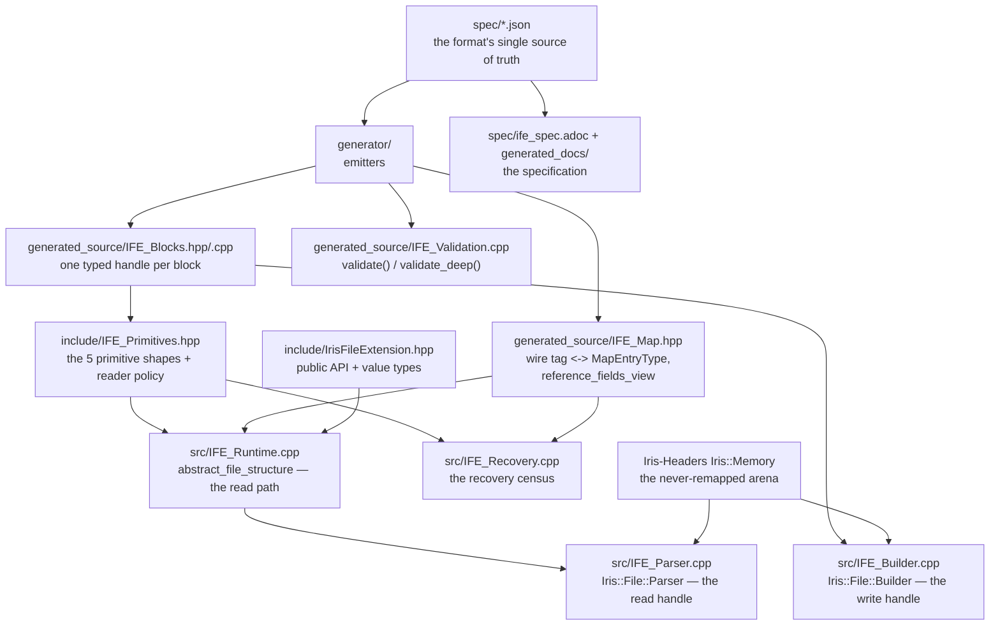
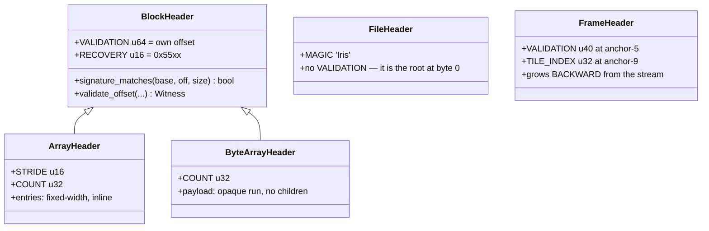
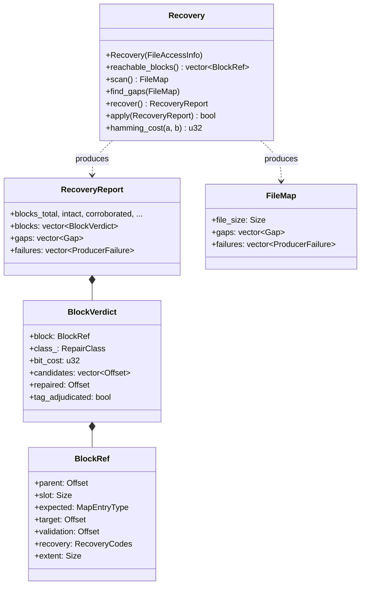
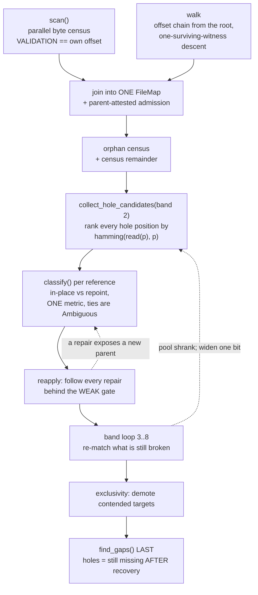
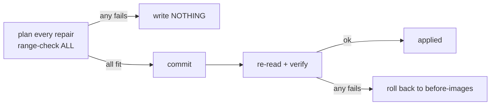

# IFE — Architecture Reference

**Scope.** How this library is layered. The *format* — every block, field,
offset and constant — is specified in `spec/ife_spec.adoc` and generated from
`spec/*.json`; this document does not restate it. What it does explain is the
machinery around those bytes: which layer owns which fact.

> **⚠ RECOVERY IS BEING REBUILT (2026-09-28)** on FastFHIR's census and
branch-solver design (MIGRATION.md `# ▶ RECOVERY REBUILD`). The census is back
(`Recovery::scan` / `census`, RB-3); the solver, the report and `apply()` are
not. Sections §3–§5 below describe the removed engine and are kept as the
design record; they do **not** describe the current tree.

Read `CLAUDE.md` first. It carries the invariants and the traps; this file
carries the shape.

---

## 1. Layers

Nothing here is hand-maintained below the spec. A field's offset exists in
exactly one place, and every other place derives from it.

**The rule that keeps this honest:** never hand-edit anything in
`generated_source/`. Fix the emitter in `generator/emit/` and regenerate. A
schema edit needs a `cmake .` before it reaches a build directory.

### Who owns which fact

| Fact | Owner | Never |
|---|---|---|
| a field's offset and width | `spec/*.json` → generated handle | a literal in hand-written code |
| what type a slot must point at | the parent's generated accessor, and `reference_fields_view` for code that walks the graph generically (both compiled from `points_to`) | read from the wire |
| a block's extent | the block's own `extent()` | fabricated, or taken from the arena's capacity |
| an array's element shape | the parent's compiled handle | derived from the array's wire tag |
| how many entries an array has | its stamped `COUNT`, bounded by arena geometry | a walk that stops at the first invalid entry |
| whether a block is the one it claims to be | `validate()` — a handle's bool | an offset that merely lands in range (`in_bounds()` is for code that reads damaged files on purpose) |
| how to repair a damaged block | the recovery engine — absent from this revision, being rebuilt | the read path, which refuses and never repairs (§6) |
| how the stream is mutated: claims, bounds, fills, tile placements and frames | `Builder` | the application calling it |
| the layout — which block goes where, in what order | the application, through the order of its `append_*` / `claim` + `fill` calls | the `Builder` |
| the file's name, and moving it | the application | the `Builder` |

### The handles, and the split with an application

IFE's public handles are `Iris::File::Builder` (write) and `Iris::File::Parser`
(read). An application *owns* one — Iris-Codec's Encoder holds a Builder, its
Slide holds a Parser — and IFE never depends on the application: the codec
depends on IFE, not the reverse.

| Layer | Owns | Never |
|---|---|---|
| application (e.g. an encoder) | sources, compression, threads and which thread encodes which tile, progress, the layout (the order it places blocks in), file names and moving files | claim arithmetic, bounds, `base + offset` writes, `store` / `size_of` |
| `Builder` | the reservation, byte-space claims and fills, every block write, the tile placements, tile frames, the completeness check, the header, a closed file at `finalize` | threads, scheduling, codecs, the layout, choosing or moving files |
| application (e.g. a slide reader) | decompression, pixel formats, output buffers | mapping the file, `base + offset` |
| `Parser` | the read-only mapping (owned via `Parser::open`), validation, the lifted structure, bounds-checked byte spans | decoding |

The worked example: writing to the temp directory and moving the finished file
into place is the application's policy. It names the temp file, hands the path
to `Builder::create`, and moves the file once `finalize` returns; the Builder's
contract is only to leave the file complete, truncated and closed. Ask of any
new feature: does it decide *what or where* (application) or *how the bytes are
laid down* (Builder)? The layout is a *where*: every `append_*` lands at the
head when it is called, so the application's call order is the file's order.

**The same verbs as FastFHIR.** The handles are FastFHIR's (`../FastFHIR`,
`FF_Access.hpp` / `FF_Builder.hpp` and its Python module), so a programmer who
knows one reads the other. Where a concept exists in both, it has the same name
and shape; keep it that way, and model IFE's Python bindings (R-4) on
FastFHIR's `ff.Memory` / `ff.Builder` the same way.

| Concept | FastFHIR | IFE |
|---|---|---|
| make a writer | `FF_CreateBuilder({capacity, filepath, …})`; body `Builder_t(Memory, …)` | `Builder::create({capacity, filepath, tile_frames})`; body `Builder_t(Memory, info)` |
| write a block at the head, get its offset | `builder->append(T)` | `builder->append(XxxCreateInfo)`; `append_tile` / `append_image` / `append_tile_table` / `append_images` / `append_attributes` |
| reserve raw space | `claim_child_space(bytes)` | `builder->claim(bytes)` |
| write into space claimed earlier | `claim_child_space` + a four-argument `STORE_*` | `builder->fill(offset, XxxCreateInfo)` |
| name the root(s), then seal | `set_root(handle)` (Python `builder.root = node`), then `finalize(algo)` | `finalize({tileTable, metadata, revision})` — the header has two roots |
| read | `Parser(buffer, size)`, `Parser(Memory)` | `Parser(FileAccessInfo)`, `Parser::open(path)` |

**The arena never remaps.** A Builder reserves a large sparse range (8 GiB by
default) and never moves it: growth is pages touched inside the reservation, and
exhausting it is terminal. A fixed base is what lets `append_tile` claim space
lock-free from many threads. On Windows an anonymous arena is reserved, not
committed, so every claim commits its range first (`Iris::Memory::commit`).

---

## 2. The five primitives

Every block in the inventory instantiates exactly one shape
(`include/IFE_Primitives.hpp`). Recovery dispatches on the shape, not on the
tag, because the three families are walked differently.

Three consequences the engine depends on:

* a **DATABLOCK** is a set of slots — walk its accessors;
* an **ARRAY** is a stride and a count over inline entries that carry **no
  witnesses of their own**, so the array's own `VALIDATION`/`RECOVERY` cover
  all of them: losing an array loses its whole contents;
* a **BYTE ARRAY** is an extent with no children — a leaf, and a different
  answer from "unknown type";
* the **FRAME** is the only structure laid out backward, and it is optional, so
  a tile stream may have one or not. See `CLAUDE.md` for why that layout is
  deliberate.

---

## 3. Recovery: the types

`BlockRef` is the atom: one parent→child edge carrying **both witnesses** plus
the compiled expectation. `BlockVerdict` is that edge plus what recovery
decided. Everything the engine reports is a list of verdicts — there is no
side channel.

### The verdict classes

| Class | Means | `apply()` writes |
|---|---|---|
| `Intact` | both witnesses agreed | nothing |
| `Corroborated` | parent's offset was damaged; a surviving orphan is the child | the parent slot |
| `HoleCorroborated` | same, but the child is a ranked **hole** position — the pointer is restored, the bytes are still destroyed | the parent slot |
| `TagRepaired` | the child's `RECOVERY` tag was the damaged half | the child's tag — **only** if the wire tag is implausible, or coherence adjudicated it |
| `PositionRepaired` | the child's `VALIDATION` was the damaged half | the child's VALIDATION |
| `ExtentDerived` | an array's claimed extent overruns the next entry | the array's COUNT |
| `Ambiguous` | two live readings at equal cost | **nothing, ever** |
| `Unrecovered` | nothing within the flip budget | **nothing, ever** |

`Ambiguous` and `Unrecovered` are reported *because the engine declined to
choose*. Writing them would convert a declared uncertainty into a silent one.

---

## 4. Recovery: the pipeline

Two producers fail in **opposite** directions, which is why both run:

| producer | finds | cannot see |
|---|---|---|
| the offset-chain walk | broken references — a slot whose target does not resolve | a block nothing points at |
| the byte scan | orphans — self-consistent blocks nothing references | a block whose `VALIDATION` is damaged |

Two properties of that picture carry the design:

* **the byte sweep is outside the loop** (built once) and the loop iterates
  **references**, of which there are few. Sweeping bytes and asking "does any
  reference want this?" inverts the cheap and expensive sides.
* **the arrow back from *reapply* into *classify*** is the generational
  cascade. A repaired block is now a *parent* whose outgoing references have
  never been looked at — the walk could not reach it, the scan could not
  identify it. Cut that arrow and every chain of losses stops at its first
  repair.

### Where each step lives

`src/IFE_Recovery.cpp` reads top-to-bottom from `recover()`. Line numbers are
a starting point, not a contract — grep the name if one has drifted.

| Line | What |
|---|---|
| `87` | `read_witnesses` — loads the child's VALIDATION + tag |
| `214` | `enumerate_tile_offsets` — the one headerless edge; reads the frame |
| `426` | `enumerate_one_level` — dispatches on block SHAPE |
| `490` | `drive_walk` — the offset-chain walk |
| `646` | `Recovery::Recovery` — binds base/size; never dereferences a header |
| `664` | `scan()` — the parallel byte census |
| `804` | `find_gaps()` — the tiling; Hole / VersionSkew / Trailing |
| `892` | `HoleCandidate` + `collect_hole_candidates` — the ranked pool |
| `1016` | `batch_passes` — the two gate strengths |
| `1113` | `frame_tile_index` / `entry_tile_index` — the identity witness |
| `1145` | `classify()` — the per-reference verdict |
| `1472` | `recover()` — the pipeline above |
| `2207` | `apply()` — the only mutating path |

---

## 5. `apply()` — the only mutating path

Plan every repair and range-check it **before touching a byte**, commit, re-read
each committed run, and roll the whole report back to its before-images if any
write fails to verify. IFE repairs the caller's own buffer, so those
before-images play the role of a working copy.

A repair class that rewrites a **type** is far more dangerous than one that
rewrites a **position**: a wrong position fails loudly at the next witness
check, while a wrong type silently relabels real data and removes that block's
subtree from the census permanently. That is why `TagRepaired` is gated.

---

## 6. Known gaps

Explicit so they are not rediscovered as bugs.

* **The read path refuses; it does not repair.** Since RC-10.1 a handle's bool
  is `validate()`, so `abstract_file_structure()` throws on a structurally
  damaged file instead of reading it — 58–65% of one-bit trials. Reopening one
  needs the recovery engine, which is being rebuilt; until it returns there is
  no in-process path. Reference-level integrity is still not
  content-level integrity: a flipped inline scalar has no second witness and
  reads back changed (RC-10.2).
* **Iris-Codec writes no tile frames yet.** `TILE_INDEX` is the only identity
  witness in the format. The `Builder` frames every tile by default (and every
  tile of a Z-stacked layer always), so real slides gain it once the codec's
  encoder moves onto the Builder.
* **Block edges have no identity witness.** A flipped offset landing on a
  valid block of the same type satisfies both witnesses at the new address;
  recovery calls it `Intact` and is right to. Measured on the corpus with
  METADATA's `ATTRIBUTES` slot and its three sibling blocks.
* **Warnings are on but not fatal.** Both build systems set `-Wall -Wextra
  -Wswitch` (`/W4` on MSVC) and every first-party translation unit is clean,
  but there is no `-Werror`, so a new warning is visible rather than blocking.
  `-Wswitch` protects `to_result` (over `Check`) and the `slice_attributes`
  switches (over `SliceError`) only because those are exhaustive `switch`es
  with no `default:` — adding a `default:` to one silently disarms it. The
  rebuilt recovery tallies must follow the same rule (CLAUDE.md).
* **Recovery finds damage but does not repair it yet.** `Recovery::census()`
  opens a question for every reference a flip damages (RB-3); the branch solver
  that answers them, and `apply()`, are RB-5 to RB-7.

---

## 7. Tests

| Target | Asks |
|---|---|
| `ife_damage_sweep_tests` | every public read entry point over every single bit flip of every fixture: nothing reads outside the file (run it under ASan/UBSan), a file that validates can be read, and returned ranges and Parser spans lie inside the file |
| `ife_recovery_tests` | the census, as FastFHIR tests its own: a clean file is one attached island matching `generate_file_map`; a newer writer's skew is no hole; every single flip opens exactly the points it explains |
| `ife_v1_oracle_tests` | generated offsets against the frozen 1.0 witness |
| `ife_builder_tests` | the block tier (`claim` / `append` / `seal`): the header region is reserved, tile entries are bounds-checked on read, Z-stacked tiles must be framed, the never-remapped reservation, a closed file at seal |
| `ife_builder_layered_tests` | the application tier: threaded `append_tile` in any order, null tiles, images, the caller-placed structure round-trips through the read path in either of two layouts (METADATA `claim`ed early and `fill`ed last, or appended last); misuse throws and a refused write writes nothing |
| `ife_parser_tests` | `Parser::open` owns its mapping; zero-copy `tile()` / `image()` spans; `tile_planes()`; lifetime across handle copies |

Every test target — the rebuilt recovery targets included — is registered in
**both** `tests/tests.cmake` and `tests/tests.bzl`. A defect reachable through only one build system is
invisible, which has happened.
