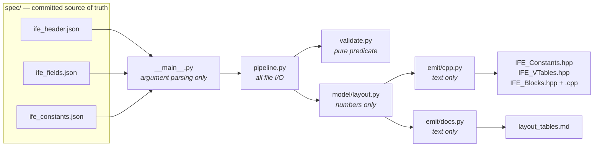

# `generator/` — the IFE code generator

Turns the committed spec JSON
(`spec/ife_header.json`, `spec/ife_fields.json`, `spec/ife_constants.json`)
into the C++ that Iris-File-Extension compiles — and the derived layout tables
the LaTeX/HTML specification document renders.

Run it with:

```bash
python3 -m generator                    # writes generated_source/ + generated_docs/
python3 -m generator --out-dir DIR      # write the C++ elsewhere
python3 -m generator --validate         # conflicts and dangling references only
python3 -m generator --check            # CI: exit 1 if outputs drifted
```

`--validate` runs automatically before every generation, so a broken spec
never reaches the emitters.

## Output contract

| Output | Contract |
|--------|----------|
| `spec/*.json` | **Source of truth. Committed.** Identity, fields, types, values. |
| `generated_source/` | **Freely regenerable. Gitignored.** C++ layer: `IFE_Constants.hpp`, `IFE_VTables.hpp`, `IFE_Blocks.hpp` + `IFE_Blocks.cpp`. Rebuilt whenever missing at CMake configure, or on demand with `-DIFE_RUN_GENERATOR=ON`. |
| `generated_docs/` | **Freely regenerable. Gitignored.** Doc tables: `layout_tables.md`. |

The five outputs are registered in one place — `pipeline.py::_render` — and
`--check` covers whatever that map contains, so adding an artifact never means
remembering to extend the drift gate.

Nothing generated is permanent — but the *vtable layout* is, which is why
the JSON is versioned append-only.

## CLI contract (final)

| Flag | Default | Meaning |
|------|---------|---------|
| `--schema-dir` | `spec/` | Directory holding `ife_header.json` + `ife_fields.json` + `ife_constants.json` |
| `--out-dir` | `generated_source/` | Where generated C++ is written |
| `--docs-dir` | `generated_docs/` | Where generated documentation is written |
| `--validate` | — | Check the documents for conflicts and dangling references, emit nothing (exit 1 on any) |
| `--check` | — | Regenerate in memory and fail (exit 1) if outputs drifted |

CMakeLists.txt invokes exactly this interface at configure time; changing
flags requires updating CMakeLists.txt in the same change.

## Module map



| Module | Role |
|--------|------|
| `__main__.py` | CLI entry point (`python -m generator`); contract above. |
| `pipeline.py` | Stage orchestration: load JSON → validate → derive → emit → write or `--check`. The only module that touches the filesystem; no code generation lives here. |
| `validate.py` | Consistency checks across the documents. Returns problems, raises nothing, reads no files. |
| `model/layout.py` | Layout derivation — the single implementation of the offset/size rules; offsets are never read from the JSON. |
| `emit/cpp.py` | C++ emission: `IFE_Constants.hpp` (enums + sentinels), `IFE_VTables.hpp` (vtables), `IFE_Blocks.hpp`/`.cpp` (handles, readers, validators). |
| `emit/docs.py` | Markdown emission: derived layout tables (first cut of the doc emitter; full spec assembly comes with the document pipeline). |

The boundary in that diagram is load-bearing: `model/` never produces text,
`emit/` never does arithmetic on a byte offset, `validate.py` never touches the
filesystem. Arithmetic found in `emit/` is in the wrong file.

CMake's configure-time gate (`EXISTS generator/pipeline.py`) runs
`python -m generator` whenever `generated_source/IFE_VTables.hpp` is
missing or `-DIFE_RUN_GENERATOR=ON`.

## Contract

* Output must be byte-stable (stable ordering, no timestamps) so CI can
  diff-check regeneration with `--check`.
* Never hand-edit `generated_source/` or `generated_docs/`; fix the JSON
  and regenerate.
