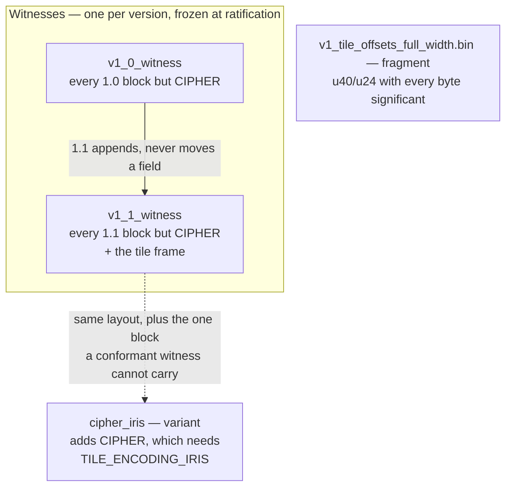

# Conformance corpus

Real bytes on disk, pinned by digest. The corpus exists so the test suite
proves the stack reads **files that exist**, rather than re-deriving the format
from the same schema it was generated from.

> **`v1_0_witness.test_slide` is no longer an independent witness — read this
> before relying on it.** It was written by the shipped v1 encoder, which made
> it evidence about *another implementation's* bytes: the one check that cannot
> be fooled by a reader and a writer agreeing with each other about the wrong
> thing. That ended with the 1.0 correction that gave `ATTRIBUTE_SIZE` its
> `KIND` byte. The entry went from six bytes to seven, a stride of six stopped
> being conformant, and the array validator now rejects the original (2857 B,
> `658ead7c…`) — correctly. v1's writers were deleted in Phase 6, so nothing
> but the generated layer can produce a corrected file.
>
> The replacement is written by `tests/ife_snapshot_writer.cpp` against a
> **1.0-only** generated layer, derived from the committed spec by
> `tests/fixtures/build_baseline_spec.py`. That indirection is load-bearing:
> `store()` always lays out the newest version it knows, so a writer built from
> the committed spec emits 1.1, and the oracle's substance is a 1.1 reader over
> 1.0 bytes — `TILE_LENGTH` and `Z_PLANES` reading back absent, the layer
> extent stride at the 1.0 entry size. A 1.1 fixture proves none of that.
>
> The result is **3151 B** against v1's 2857. The root attributes structure
> holds three entries — a text value, a two-item sequence, and an empty
> sequence — so the file carries **three** `ATTRIBUTES` structures with their
> sizes and byte arrays; nesting is exercised against pinned bytes rather than
> only in memory. The sequence items are written before the byte run that names
> them, so blocks after the attribute region no longer sit at the offsets v1
> gave them.
>
> It also carries the two annotation-group blocks (added 2026-08-18 to make the
> 1.0 witness comprehensive — both are 1.0 fields, so they belong here rather
> than in a later version). Two groups, of different title lengths and member
> counts: one group cannot prove the byte run is sliced at all, and equal-sized
> groups cannot prove the slice moves with the entry rather than by a fixed
> stride.
>
> **What is kept:** the digest pin, so a schema edit that moves a shipped field
> breaks reading a file nobody regenerated. **What is lost:** the cross-check,
> until a second implementation exists to write a fixture. One assertion died
> outright rather than moving — v1 stored `METADATA_FREE_TEXT` as an alias of
> `METADATA_I2S`, and demonstrating that errata needs bytes a v1 encoder
> actually wrote.

## How the corpus is organised

**One witness per IFE version, each covering every block that version
defines.** The set grows; no entry is ever rewritten. A witness is mutable
while its version is draft and **frozen when that version ratifies**, which is
what makes the version trail immutable — and the trail is the point: a current
reader reading frozen 1.0 bytes is the only real-bytes proof of backward
compatibility, and `ife_v1_oracle_tests` is built on exactly that (it asserts
the file declares 1.0 and reads every field through a handle at that version).
A corpus regenerated at head would delete that evidence on its first
regeneration.

The newest witness doubles as the feature corpus while its version is draft,
so there is no separate "moving" fixture to keep in step.

| Fixture | Role | Covers |
|---|---|---|
| `v1_0_witness.test_slide` | witness, frozen | every block 1.0 defines but `CIPHER` |
| `v1_1_witness.test_slide` | witness, draft | every block 1.1 defines but `CIPHER`, plus the tile frame |
| `cipher_iris.test_slide` | variant | the 1.1 witness plus `CIPHER` |
| `v1_tile_offsets_full_width.bin` | fragment | a bare `TILE_OFFSETS` array whose `u40`/`u24` fields have every byte significant |

**Why `CIPHER` is off on its own.** `CIPHER_OFFSET` shall be `NULL_OFFSET`
unless `ENCODING` is `TILE_ENCODING_IRIS`, and that encoding is reserved and
unused — so any file carrying the block claims an encoding no encoder
produces. Confining that claim to one small variant keeps the witnesses
conformant *and* representative. The block itself invents nothing: the schema
says encoders write nothing beyond its universal header and readers ignore its
contents.

**Not split by tile encoding.** Measured across the whole field schema, the
only thing that varies with encoding is the `ENCODING` byte; nothing else keys
off it. A `corpus_AVIF` would differ from a `corpus_JPEG` by one enum byte in
a repository whose scope excludes compression. Real AVIF bytes are Iris-Codec's
evidence, not this layer's.

Files are **hosted, not committed**: `iris.exampleslides.org` (Cloudflare R2)
serves them, `manifest.json` pins each by SHA-256, and CMake fetches into the
gitignored `.deps/corpus/` at configure time. The digest is what makes a hosted
corpus reproducible.

## `manifest.json`

Per fixture: `url`, `size`, `sha256`, the IFE `version` it was written under,
`kind`, `role`, and the `blocks` it covers.

`role` is `"witness"` (the frozen per-version record), `"variant"` (a fixture
that exists to carry something a witness cannot, currently only `CIPHER`), or
`"fragment"`.

`kind` is `"slide"` (a whole file, walkable from its file header) or
`"fragment"` (a bare block, e.g. `v1_tile_offsets_full_width.bin`). It
defaults to `"slide"`. Only a slide can have its coverage checked
structurally, so a fragment is size-checked and left out of the coverage
count rather than credited on its word.

The coverage list is not documentation. `ife_corpus_tests` walks each slide
and compares what it reaches against what is declared, **in both
directions** — a declared block the walk cannot find is a degraded fixture,
and a block reached but undeclared is a manifest that has fallen behind its
own evidence. Both fail. (The second is not hypothetical: the gate's first
run found `TILE_PIXEL_DATA` present and undeclared.)

Adding a fixture is a manifest entry, an upload, **and a `data` entry in the
`ife_corpus_tests` target in `tests/tests.bzl`**. That third step is easy to
miss: CMake passes the corpus *directory*, so it picks up a new fixture with no
build change, while Bazel builds a runfiles tree from an explicit list and the
test fails to open a file that is not in it.

The corpus is a living set: it grows with coverage and with each new IFE
version.

## Coverage

The corpus reaches **18 of the 18 block types**, plus the optional tile frame
(`TILE_FRAME`, a prefix rather than one of the 18). That number is produced by
`ife_corpus_tests` from what it actually walked — never from what the manifest
claims, so a fixture that fails to load subtracts from it instead of being
credited with everything it declared.

`TILE_FRAME` is worth a note: it carries no recovery tag and is addressed
backward from the stream it precedes, so the offset graph has no edge leading
to it and `generate_file_map` cannot see it at all. The harness unions in
`recover_file_structure`, whose signature match does find it — which also means
the corpus exercises the recovery path over real bytes, something nothing else
did. See `CLAUDE.md` for why the frame grows backward.

**Optional values, not just optional blocks.** All eight nullable offsets are
reached (five on `METADATA`, both `ANNOTATIONS` group offsets, and
`CIPHER_OFFSET` in the variant), and the 1.1 witness now sets every 1.1
optional *value* to something a default cannot fake:

| Value | Setting | Why not the default |
|---|---|---|
| `TILE_TABLE.TILE_LENGTH` | 128 | zero *and* absence both mean 256, so an unset field cannot tell a decoder honouring it from one assuming the default |
| `LAYER_EXTENT.Z_PLANES` | 3 | distinguishes "one plane" from "absent" |
| `TILE_PIXEL_DATA.Z_PLANES` | 3, 0, 0 | a tile may carry fewer planes than its layer's maximum; only differing siblings expose a reader that takes the layer's value for the tile's |
| `METADATA.MICRONS_PLANE` | 0.5 | — |
| `TILE_OFFSETS` entry | one `NULL_TILE` | a sparse layer is the only thing that exercises the sentinel |
| `FILE_REVISION` | 7 | not confirmed only at 0 |

Reading the same fields on the 1.0 witness returns **absent** for every one of
them, which is the version gate working on real bytes rather than on the
synthetic 200.0 fixture.

Still uncovered: tile encodings other than JPEG, and `clinical_encodings`
values beyond `CLINICAL_HL7_V2`.

Two things need no fixture. Slides over 4 GiB are covered by
`ife_large_file_tests` (a 4.00 GiB sparse file, 28 KiB actually allocated), and
both byte orders are unnecessary — IFE is little-endian at every version, and
the s390x CI leg exercises the reader.

## Rules that are easy to get wrong

* **Unreachable corpus fails; it does not skip.** `-DIFE_CORPUS=OFF` is the
  explicit opt-out, and it disables only the corpus test — never the fetch,
  which the oracle, the runtime tests and the >4 GiB test all depend on.
* **The zone's bot protection rejects `Python-urllib`** (Cloudflare error
  1010). `tools/fetch_corpus.py` sends `ife-corpus-fetch/1.0`. Keep a
  non-default user agent if the host ever changes.
* **The published [Iris-Example-Files](https://github.com/IrisDigitalPathology/Iris-Example-Files)
  do not serve as a corpus.** Both are the same specimen with empty metadata
  and reach 6 of 18 block types; building on them would narrow real-byte
  coverage rather than replace it. Fixtures are purpose-built and small — a
  valid pyramid with real JPEG tiles is under 5 MB.
